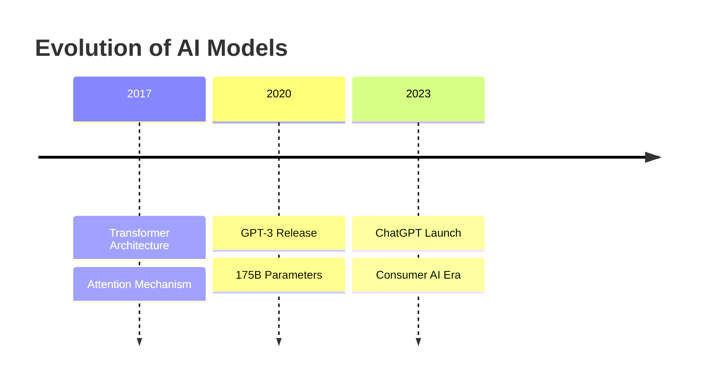

# Claude Code Analyst

<div align="center">

[](https://www.python.org/)
[](https://docs.astral.sh/uv/)
[](https://claude.ai/code)
[](LICENSE)

**Transform web content into structured knowledge with AI-powered analysis tools**

[Features](#-features) • [Quick Start](#-quick-start) • [Documentation](#-documentation) • [Examples](#-examples)

</div>

## 📋 Overview

Claude Code Analyst is a comprehensive toolkit for capturing, converting, and visualizing web content. Built specifically for [Claude Code](https://claude.ai/code) integration, it provides powerful utilities to transform unstructured web content into clean Markdown documents, preserve complete HTML archives, and generate insightful Mermaid.js visualizations.

### Why Claude Code Analyst?

- **🌐 Complete Content Capture**: Convert web articles to Markdown OR preserve as clean HTML archives
- **📊 Content Intelligence**: Extract structured data with comprehensive metadata preservation
- **🎨 Visual Understanding**: Automatically generate diagrams from text to reveal hidden patterns and relationships
- **🚀 Production Quality**: Respects robots.txt, handles edge cases, and produces clean, consistent output

## ✨ Features

### 🔄 Article to Markdown Converter
Transform web articles into clean, portable Markdown files:

- **Smart Extraction**: Uses Mozilla's Readability algorithm to extract main content while filtering out ads, navigation, and clutter
- **Image Preservation**: Downloads and organizes images with proper relative path references
- **Rich Metadata**: Captures title, publication date, word count, and source attribution in YAML frontmatter
- **Dual Input Support**: Works with both web URLs and local HTML files
- **Respectful Scraping**: Checks robots.txt before processing any URL
- **Clean Output**: Generates well-formatted Markdown with preserved text flow

### 🌐 HTML Page Downloader
Create self-contained HTML archives of web pages:

- **Complete Preservation**: Downloads entire web pages as clean, readable HTML documents
- **Smart Content Extraction**: Uses advanced algorithms to identify and extract main content
- **Image Archiving**: Downloads all referenced images with proper HTTP headers to bypass basic protection
- **Enhanced Substack Support**: Properly handles Substack articles with anchor-wrapped images
- **Comprehensive Metadata**: Preserves OpenGraph, Twitter cards, publication dates, and source attribution
- **Professional Styling**: Generates clean HTML5 output with embedded responsive CSS
- **Offline Ready**: Creates fully self-contained archives perfect for offline reading and research

### 📊 Mermaid Visualization Generator
Create intelligent visualizations from Markdown content:

- **Auto-Analysis**: Identifies concepts, workflows, timelines, and relationships from text
- **Multiple Diagram Types**: Generates flowcharts, timelines, mind maps, Sankey diagrams, and more
- **Contextual Output**: Each visualization includes relevant source text and explanations
- **Batch Processing**: Creates comprehensive visualization sets from single documents
- **Claude Code Integration**: Available as a custom `/mermaid` command

### 🖼️ Mermaid to Image Converter
Convert Mermaid diagrams to high-quality images:

- **Professional Quality**: Uses official Mermaid CLI for production-grade rendering
- **Multiple Formats**: Export as PNG, SVG, or PDF with configurable themes and dimensions
- **Batch Processing**: Convert multiple diagrams from a single markdown file
- **Organized Output**: Sequential naming and proper folder structure
- **Theme Support**: Default, dark, forest, neutral, and base themes available
- **Custom Configuration**: Configurable via `config.yml` for dimensions, themes, and output settings

## 🚀 Quick Start

### Prerequisites

- Python 3.13+
- [uv](https://docs.astral.sh/uv/) package manager
- Optional: [Mermaid CLI](https://github.com/mermaid-js/mermaid-cli) for image conversion

### Installation

```bash
# Clone the repository
git clone https://github.com/manavsehgal/claude-code-analyst.git
cd claude-code-analyst

# Install dependencies with uv
uv sync
```

### Basic Usage

#### 1️⃣ Convert Web Article to Markdown

```bash
# Convert any web article
uv run python scripts/article_to_md.py https://example.com/article

# Convert local HTML file
uv run python scripts/article_to_md.py /path/to/local/file.html

# Specify custom output directory
uv run python scripts/article_to_md.py https://example.com/article --output-dir my-articles
```

**Output Structure:**
```
markdown/
└── article-title-kebab-case/
    ├── article.md        # Clean Markdown with YAML frontmatter
    └── images/           # Preserved images
        ├── image1.jpg
        └── image2.png
```

#### 2️⃣ Download HTML Archive

```bash
# Download complete HTML archive
uv run python scripts/html_downloader.py https://example.com/article

# Custom output directory
uv run python scripts/html_downloader.py https://example.com/article --output-dir archives

# Skip robots.txt check (use responsibly)
uv run python scripts/html_downloader.py https://example.com/article --skip-robots
```

**Output Structure:**
```
html/
└── article-title-kebab-case/
    ├── index.html        # Self-contained HTML document
    └── images/           # All downloaded images
        ├── diagram1.png
        └── chart2.svg
```

#### 3️⃣ Generate Visualizations (Claude Code)

```bash
# In Claude Code, use the custom command
/mermaid markdown/article-title/article.md
```

**Output Structure:**
```
mermaid/
└── article-title/
    ├── 01-timeline.md
    ├── 02-flowchart.md
    ├── 03-relationships.md
    └── README.md
```

#### 4️⃣ Convert Visualizations to Images

```bash
# Convert Mermaid diagrams to high-quality images
uv run python scripts/mermaid_to_image.py mermaid/article-title/01-timeline.md --format png --theme dark

# Batch convert all diagrams in a file
uv run python scripts/mermaid_to_image.py mermaid/article-title/workflow.md --format svg
```

**Output Structure:**
```
visualizations/
└── article-title/
    ├── 01-timeline-01.png
    ├── 02-flowchart-01.svg
    └── 03-relationships-01.pdf
```

### 🔗 Complete Workflow Examples

#### Research & Analysis Workflow
```bash
# Step 1: Create HTML archive for clean reading
uv run python scripts/html_downloader.py https://research-paper.com/ai-study

# Step 2: Create Markdown for text analysis  
uv run python scripts/article_to_md.py https://research-paper.com/ai-study

# Step 3: Generate visualizations (in Claude Code)
/mermaid markdown/ai-study/article.md

# Step 4: Convert diagrams to presentation-ready images
uv run python scripts/mermaid_to_image.py mermaid/ai-study/01-workflow.md --format png --theme dark

# Result: Complete research package with readable archive, processable text, 
# and visual insights with presentation-ready images
```

#### Documentation Preservation
```bash
# For offline documentation that preserves original styling
uv run python scripts/html_downloader.py https://docs.example.com/api-guide --output-dir documentation

# For portable markdown documentation
uv run python scripts/article_to_md.py https://docs.example.com/api-guide --output-dir documentation
```

## 📚 Documentation

| Guide | Description |
|-------|------------|
| [Article Converter Guide](docs/article-to-md-guide.md) | Complete guide for Markdown conversion tool |
| [HTML Downloader Guide](docs/html-downloader-guide.md) | Comprehensive HTML archiving tool documentation |
| [Mermaid Generator Guide](docs/mermaid-visualization-guide.md) | Creating visualizations with Claude Code |
| [CLAUDE.md](CLAUDE.md) | Claude Code configuration and development settings |
| [Documentation Index](docs/README.md) | All available documentation |

## 🎯 Examples

### Article Metadata Output (Markdown)

```yaml
---
title: "Understanding Neural Networks"
source_url: https://example.com/neural-networks
article_date: 2024-12-15
date_scraped: 2024-12-20
word_count: 2847
image_count: 12
---

# Understanding Neural Networks

Article content with preserved formatting and ...
```

### HTML Archive Features

```html
<!DOCTYPE html>
<html lang="en">
<head>
    <!-- Comprehensive metadata preservation -->
    <meta name="source-url" content="https://original-url.com">
    <meta property="og:title" content="Article Title">
    <meta name="twitter:card" content="summary_large_image">
    
    <!-- Embedded responsive styling -->
    <style>
        body { font-family: -apple-system, BlinkMacSystemFont, 'Segoe UI'... }
        img { max-width: 100%; height: auto; }
    </style>
</head>
<body>
    <!-- Clean, readable content with local image references -->
    
</body>
</html>
```

### Generated Mermaid Visualization



## 🏗️ Project Structure

```
claude-code-analyst/
├── scripts/                    # Python tools and utilities
│   ├── article_to_md.py       # Web article to Markdown converter
│   ├── html_downloader.py     # HTML page archiving tool
│   └── mermaid_to_image.py    # Mermaid diagram to image converter
├── docs/                       # User guides and documentation
│   ├── README.md              # Documentation index
│   ├── article-to-md-guide.md
│   ├── html-downloader-guide.md
│   └── mermaid-visualization-guide.md
├── html/                       # HTML archives (generated)
│   └── article-title/
│       ├── index.html
│       └── images/
├── markdown/                   # Converted articles (generated)
│   └── article-title/
│       ├── article.md
│       └── images/
├── mermaid/                   # Visualizations (generated)
│   └── article-title/
│       └── *.md
├── visualizations/            # Generated images (from mermaid_to_image.py)
│   └── article-title/
│       ├── diagram-01.png
│       ├── chart-02.svg
│       └── flow-03.pdf
├── projects/                  # Analysis projects
├── transcripts/              # Video transcripts
├── backlog/                  # Project planning
│   └── active-backlog.md
├── tests/                    # Test suite
├── .claude/                  # Claude Code custom commands
│   └── commands/
│       ├── mermaid.md        # Mermaid visualization generator
│       └── readme.md         # README generation command
├── CLAUDE.md                 # Claude Code configuration
├── pyproject.toml           # Project dependencies
└── README.md                # This file
```

## 🛠️ Development

### Setup Development Environment

```bash
# Install all dependencies
uv sync

# Install development dependencies
uv sync --dev

# Run tests
uv run pytest tests/

# Code quality checks
uv run ruff check .
uv run black .
uv run mypy .
```

### Code Style

- Follow PEP 8 guidelines
- Use type hints for all functions
- Write comprehensive docstrings
- Maintain test coverage
- Respect robots.txt and website terms of service

## 📦 Dependencies

| Package | Purpose |
|---------|---------|
| `requests` | Web fetching and HTTP handling |
| `beautifulsoup4` | HTML parsing and manipulation |
| `markdownify` | HTML to Markdown conversion |
| `readability-lxml` | Article content extraction |
| `mermaid-mcp` | Mermaid diagram processing and image conversion |
| `pyyaml` | Configuration file handling |
| `ruff` | Fast Python linting |
| `black` | Code formatting |
| `mypy` | Static type checking |
| `pytest` | Testing framework |

## 🎯 Use Cases

### 📚 Research & Academia
- **Academic Papers**: Archive research papers as HTML for citation and clean Markdown for analysis
- **Literature Reviews**: Convert multiple sources to consistent formats for comparative analysis
- **Reference Management**: Build structured knowledge bases with metadata preservation

### 📖 Documentation & Knowledge Management
- **Technical Documentation**: Convert API docs to portable Markdown or preserve as styled HTML
- **Team Knowledge Base**: Archive important articles and resources for offline access
- **Competitive Intelligence**: Analyze competitor content and track changes over time

### 📰 Content Analysis & Journalism
- **News Archiving**: Preserve news articles before they change or disappear
- **Content Migration**: Move content between platforms while maintaining formatting
- **Fact Checking**: Create timestamped archives of web content for verification

### 🏢 Business Intelligence
- **Market Research**: Archive industry reports and analysis
- **Competitive Analysis**: Track competitor announcements and strategy documents
- **Compliance**: Maintain records of regulatory content and policy changes
- **Strategic Planning**: Visualize business processes and strategies from archived content

## 🚦 Roadmap

### Completed Features ✅
- [x] Article to Markdown conversion with metadata (web URLs and local HTML files)
- [x] HTML page archiving with image preservation and enhanced Substack support
- [x] Mermaid visualization generation (Claude Code integration)
- [x] Mermaid to image conversion (PNG, SVG, PDF export)
- [x] Comprehensive documentation and user guides

### Planned Enhancements 🔄
- [ ] PDF article processing support
- [ ] Batch processing multiple URLs with progress tracking
- [ ] Custom CSS themes for HTML archives
- [ ] Export to additional formats (JSON, CSV, EPUB)
- [ ] Enhanced metadata extraction (author detection, category classification)
- [ ] API endpoint for programmatic access
- [ ] Video/audio content transcription and processing
- [ ] Archive compression (ZIP/TAR formats)
- [ ] Integration with more visualization formats beyond Mermaid

## 🤝 Contributing

We welcome contributions! Please follow these guidelines:

1. **Fork the repository** and create a feature branch
2. **Follow PEP 8** and add comprehensive type hints
3. **Write tests** for new functionality (aim for >80% coverage)
4. **Update documentation** for any user-facing changes
5. **Respect ethical guidelines** - ensure tools are used responsibly
6. **Test thoroughly** with various website types and edge cases

### Development Workflow

```bash
# 1. Setup development environment
git clone https://github.com/manavsehgal/claude-code-analyst.git
cd claude-code-analyst
uv sync

# 2. Create feature branch
git checkout -b feature/amazing-feature

# 3. Make changes and test
uv run pytest tests/
uv run ruff check .

# 4. Commit and push
git commit -m 'Add amazing feature'
git push origin feature/amazing-feature

# 5. Open Pull Request
```

See [CLAUDE.md](CLAUDE.md) for detailed development guidelines.

## 📄 License

This project is licensed under the MIT License - see the [LICENSE](LICENSE) file for details.

## 🔒 Ethical Usage

This toolkit is designed for legitimate research, documentation, and analysis purposes. Please use responsibly:

- **Respect robots.txt** and website terms of service
- **Don't overload servers** - use reasonable delays between requests
- **Respect copyright** - maintain proper attribution and don't republish without permission
- **Be transparent** - the tools identify themselves with appropriate User-Agent strings

## 🙏 Acknowledgments

- [Mozilla Readability](https://github.com/mozilla/readability) for content extraction algorithms
- [Mermaid.js](https://mermaid.js.org/) for beautiful diagram rendering
- [Claude Code](https://claude.ai/code) for AI-powered development capabilities
- [uv](https://docs.astral.sh/uv/) for modern Python package management
- [BeautifulSoup](https://www.crummy.com/software/BeautifulSoup/) for robust HTML parsing

## 📮 Support

- 📖 **Documentation**: Check the comprehensive [guides](docs/) for detailed instructions
- 🐛 **Bug Reports**: Use the [GitHub issue tracker](https://github.com/manavsehgal/claude-code-analyst/issues)
- 💡 **Feature Requests**: Join discussions in the [community forum](https://github.com/manavsehgal/claude-code-analyst/discussions)
- 🚀 **Claude Code**: Integrated custom commands for seamless workflow

---

<div align="center">

**Built with ❤️ for the Claude Code community**

[⬆ Back to Top](#claude-code-analyst)

</div>