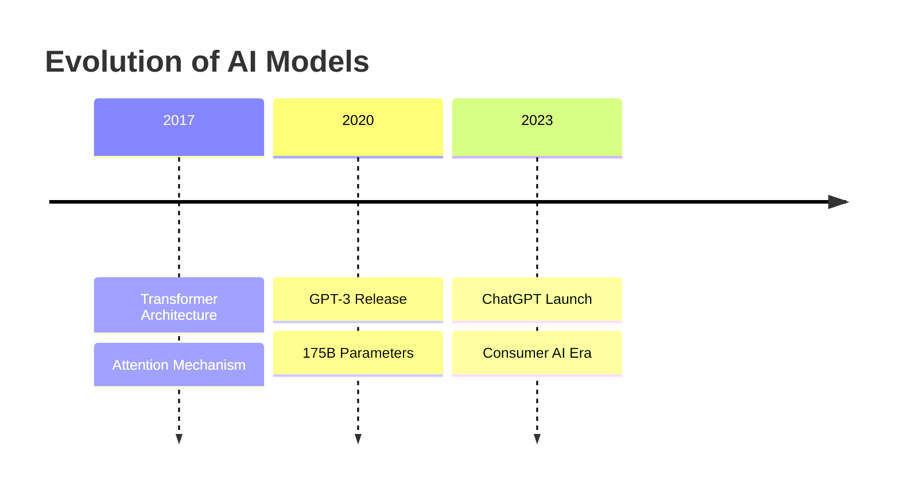

# Claude Code Analyst

<div align="center">

[](https://www.python.org/)
[](https://docs.astral.sh/uv/)
[](https://claude.ai/code)
[](LICENSE)

**Transform web content into structured knowledge with AI-powered analysis tools**

[Features](#-features) • [Quick Start](#-quick-start) • [Documentation](#-documentation) • [Examples](#-examples)

</div>

## 📋 Overview

Claude Code Analyst is a comprehensive toolkit for capturing, converting, and visualizing web content. Built specifically for [Claude Code](https://claude.ai/code) integration, it provides powerful utilities to transform unstructured web articles into clean Markdown documents and generate insightful Mermaid.js visualizations.

### Why Claude Code Analyst?

- **📊 Content Intelligence**: Convert any web article into structured, analyzable Markdown with metadata
- **🎨 Visual Understanding**: Automatically generate diagrams from text to reveal hidden patterns and relationships
- **🤖 AI-Ready**: Seamlessly integrates with Claude Code for enhanced content analysis workflows
- **🚀 Production Quality**: Respects robots.txt, handles edge cases, and produces clean, consistent output

## ✨ Features

### 🔄 Article to Markdown Converter
Transform web articles into clean, portable Markdown files:

- **Smart Extraction**: Uses Readability algorithm to extract main content while filtering out ads, navigation, and clutter
- **Image Preservation**: Downloads and organizes images with proper relative path references
- **Rich Metadata**: Captures title, publication date, word count, and source attribution
- **Respectful Scraping**: Checks robots.txt before processing any URL
- **Clean Output**: Generates well-formatted Markdown with YAML frontmatter

### 📊 Mermaid Visualization Generator
Create intelligent visualizations from Markdown content:

- **Auto-Analysis**: Identifies concepts, workflows, timelines, and relationships
- **Multiple Diagram Types**: Generates flowcharts, timelines, mind maps, Sankey diagrams, and more
- **Contextual Output**: Each visualization includes relevant source text
- **Batch Processing**: Creates comprehensive visualization sets from single documents
- **Claude Code Integration**: Available as a custom `/mermaid` command

## 🚀 Quick Start

### Prerequisites

- Python 3.13+
- [uv](https://docs.astral.sh/uv/) package manager
- Claude Code (for visualization features)

### Installation

```bash
# Clone the repository
git clone https://github.com/your-username/claude-code-analyst.git
cd claude-code-analyst

# Install dependencies with uv
uv sync
```

### Basic Usage

#### 1️⃣ Convert Web Article to Markdown

```bash
# Convert any web article
uv run python scripts/article_to_md.py https://example.com/article

# Specify custom output directory
uv run python scripts/article_to_md.py https://example.com/article --output-dir my-articles
```

**Output Structure:**
```
markdown/
└── article-title-kebab-case/
    ├── article.md        # Clean Markdown with metadata
    └── images/           # Preserved images
        ├── image1.jpg
        └── image2.png
```

#### 2️⃣ Generate Visualizations (Claude Code)

```bash
# In Claude Code, use the custom command
/mermaid markdown/article-title/article.md
```

**Output Structure:**
```
mermaid/
└── article-title/
    ├── 01-timeline.md
    ├── 02-flowchart.md
    ├── 03-relationships.md
    └── README.md
```

### 🔗 Complete Workflow Example

```bash
# Step 1: Capture web content
uv run python scripts/article_to_md.py https://techblog.com/ai-article

# Step 2: Generate visualizations (in Claude Code)
/mermaid markdown/ai-article/article.md

# Result: Full content analysis with text and visuals
```

## 📚 Documentation

| Guide | Description |
|-------|------------|
| [Article Converter Guide](docs/article-to-md-guide.md) | Complete usage guide for web scraping tool |
| [Mermaid Generator Guide](docs/mermaid-visualization-guide.md) | Creating visualizations with Claude Code |
| [CLAUDE.md](CLAUDE.md) | Claude Code configuration and settings |
| [Documentation Index](docs/README.md) | All available documentation |

## 🎯 Examples

### Article Metadata Output

```yaml
---
title: "Understanding Neural Networks"
source_url: https://example.com/neural-networks
article_date: 2024-12-15
date_scraped: 2024-12-20
word_count: 2847
image_count: 12
---

# Understanding Neural Networks

Article content with preserved formatting...
```

### Generated Mermaid Visualization



## 🏗️ Project Structure

```
claude-code-analyst/
├── scripts/                 # Python tools and utilities
│   └── article_to_md.py    # Web article converter
├── docs/                    # User guides and documentation
│   ├── README.md           # Documentation index
│   ├── article-to-md-guide.md
│   └── mermaid-visualization-guide.md
├── markdown/                # Converted articles (generated)
│   └── article-title/
│       ├── article.md
│       └── images/
├── mermaid/                # Visualizations (generated)
│   └── article-title/
│       └── *.md
├── backlog/                # Project planning
│   └── active-backlog.md
├── tests/                  # Test suite
├── .claude/                # Claude Code custom commands
│   └── commands/
│       └── mermaid.md
├── CLAUDE.md              # Claude Code configuration
├── pyproject.toml         # Project dependencies
└── README.md             # This file
```

## 🛠️ Development

### Setup Development Environment

```bash
# Install all dependencies
uv sync

# Run tests
uv run pytest tests/

# Code quality checks
uv run ruff check .
uv run ruff format .
```

### Code Style

- Follow PEP 8 guidelines
- Use type hints for all functions
- Write comprehensive docstrings
- Maintain test coverage

## 📦 Dependencies

| Package | Purpose |
|---------|---------|
| `requests` | Web fetching and HTTP handling |
| `beautifulsoup4` | HTML parsing and manipulation |
| `markdownify` | HTML to Markdown conversion |
| `readability-lxml` | Article content extraction |

## 🎯 Use Cases

- **📚 Research**: Archive and analyze online articles for research projects
- **📖 Documentation**: Convert web documentation to portable Markdown
- **📊 Content Analysis**: Extract insights from web content with visualizations
- **🗂️ Knowledge Management**: Build a structured knowledge base from web sources
- **📝 Blog Migration**: Extract content from various platforms
- **🔍 Competitive Analysis**: Analyze competitor content and communications

## 🚦 Roadmap

- [ ] Support for PDF articles
- [ ] Batch processing multiple URLs
- [ ] Export to different formats (JSON, CSV)
- [ ] Enhanced metadata extraction
- [ ] Custom visualization templates
- [ ] API endpoint support

## 🤝 Contributing

We welcome contributions! Please follow these guidelines:

1. Fork the repository
2. Create a feature branch (`git checkout -b feature/amazing-feature`)
3. Follow PEP 8 and add type hints
4. Write tests for new functionality
5. Update documentation as needed
6. Commit your changes (`git commit -m 'Add amazing feature'`)
7. Push to the branch (`git push origin feature/amazing-feature`)
8. Open a Pull Request

See [CLAUDE.md](CLAUDE.md) for development guidelines.

## 📄 License

This project is licensed under the MIT License - see the [LICENSE](LICENSE) file for details.

## 🙏 Acknowledgments

- [Readability](https://github.com/mozilla/readability) for content extraction algorithms
- [Mermaid.js](https://mermaid.js.org/) for diagram rendering
- [Claude Code](https://claude.ai/code) for AI-powered development
- [uv](https://docs.astral.sh/uv/) for modern Python package management

## 📮 Support

- 📖 Check the [documentation](docs/) for detailed guides
- 🐛 Report issues on the [GitHub issue tracker](https://github.com/your-username/claude-code-analyst/issues)
- 💬 Join discussions in the [community forum](https://github.com/your-username/claude-code-analyst/discussions)

---

<div align="center">

**Built with ❤️ for the Claude Code community**

[⬆ Back to Top](#claude-code-analyst)

</div>