# America Is Missing The New Labor Economy - Robotics Part 1 - SemiAnalysis

This is a Call for Action for the United States of America and the West. We are in the early precipice of a nonlinear transformation in industrial society, but the bedrock the US is standing on is shaky. Automation and robotics is currently undergoing a revolution that will enable full-scale automation of all manufacturing and mission-critical industries. These intelligent robotics systems will be the first ever additional industrial piece that is not supplemental but fully additive– 24/7 labor with higher throughput than any human—, allowing for massive expansion in production capacities past adding another human unit of work. The only country that is positioned to capture this level of automation is currently China, and should China achieve it without the US following suit, the production expansion will be granted only to China, posing an existential threat to the US as it is outcompeted in all capacities.

This is the manufacturing playing field that China has dominated for years now. The country has one of the most competitive economies in the world internally, where they will naturally achieve economies of scale and have shown themselves to be one of most skilled in high-volume manufacturing, at the same time their engineering quality has grown to be competitive in several critical industries at the highest level. This has already happened in batteries, solar, and is well underway in EVs. With these economies of scale, they are able to supply large developing markets, like Southeast Asia, Latin America, and others, allowing them to extend their advantage and influence.

**Subscribe to get notified of all SemiAnalysis articles**

Please verify your email address to proceed.

By subscribing, you agree to the [Privacy Policy](https://semianalysis.com/privacy-policy/) and [Terms and Conditions](https://semianalysis.com/terms-of-service/).

The impact of this in robotics will be exponential compared to their last strategic industry captures. These will be robotics systems manufacturing more robotics systems, and with each unit produced the cost will be driven down continuously and the quality will improve, only strengthening their production flywheel. This will repeat ad infinitum and as quality inevitably increases it will make it extraordinarily difficult for other countries to compete.

Due to the fact that robotics is a general purpose technology, this will have horizontal impacts on all manufacturing sectors and all other currently advantaged industries as well–textiles, electronics, consumer goods, etc. At the moment, the West is caught flatfooted: South Korea and Japan have a birth rate crisis that is throttling their manufacturing capabilities, European industrial sectors are being eaten alive by China and their inability to generate power, and the US is focused on other markets and procuring cheap overseas production, all the while China’s manufacturing capacity has gotten stronger and robotics is catching fire.

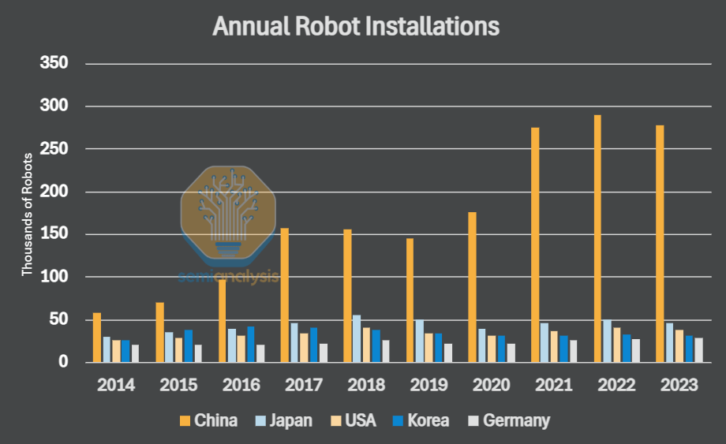

Source: SemiAnalysis, IFR.org.

China’s robotics localization effort is well underway. Local firms are taking over the world’s largest market, approaching a 50% market share, compared to just 30% in 2020. While Chinese manufacturers are currently on par with Western giants in the low-end market, our supply chain review leads us to believe that local firms are beginning to take over the higher-end market segments. The rise of Unitree exemplifies this shift: the only viable humanoid robot on the market, the Unitree G1, is now entirely decoupled from American components.

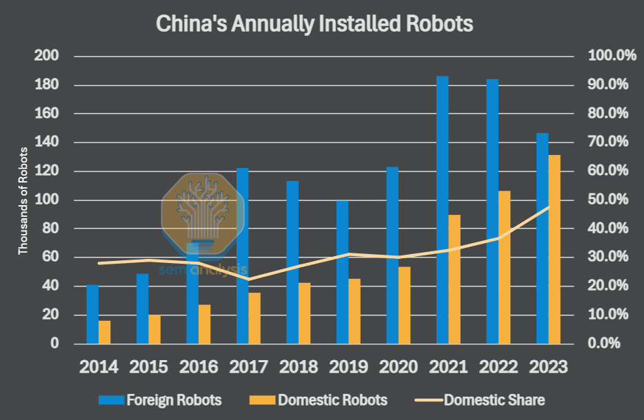

Source: SemiAnalysis, IFR.org.

Today, building an identical robot arm (modeled after the Universal Robots UR5e) in the US **is ~2.2x more expensive than in China**. Under the hood, the situation is even more alarming. Even if those components are labeled “Made in USA”, they rely *heavily* upon China-made parts and materials – with no viable scalable alternative.

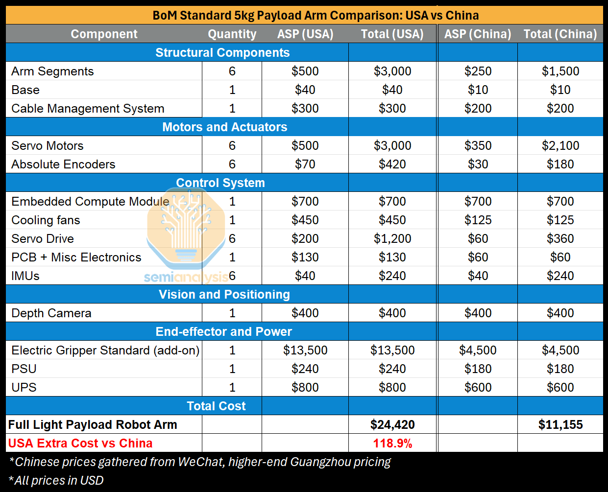

Source: SemiAnalysis

## **Drones, DJI, GoPro, and How Iteration Speed Paves Victory’s Path**

The commercial drone market exemplifies China’s scale/oversupply playbook in every strategic industry it has entered, however, this is the first example of the strategy in a robotics-adjacent market. Local leader DJI today accounts for over [80%](https://www.atlanticcouncil.org/in-depth-research-reports/issue-brief/a-global-strategy-to-secure-uas-supply-chains/) of the global commercial drone market… and 90% in the **American consumer market**! While the company was a first-mover, it maintained and consolidated its market position for over a decade thanks to China’s manufacturing dominance and economies of scale/oversupply strategy.

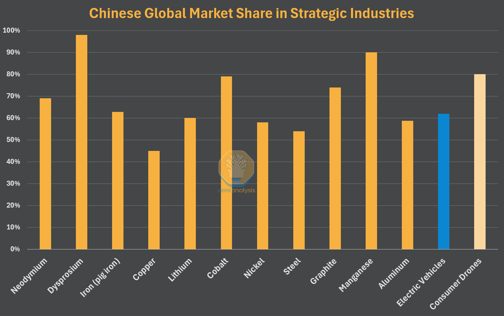

Source: SemiAnalysis, Industry Estimates

Let us explain how. To properly develop a functional and robust piece of hardware, the creation + recreation (i.e. manufacturing) must be iterated repeatedly and rapidly to work out the kinks and perfect the product before competitors. However, the most challenging thing for Western competitors is that Chinese markets are built to reward the company that can scale the fastest, so before a Chinese competitor ever enters the Western market it has already outclassed them in cost, all that’s left is for the quality to refine over the coming iterations.

GoPro tried to compete in the consumer drone market despite having most of its manufacturing based in China, Malaysia, and Japan, which meant that each iteration of their drone took several weeks – likely starting the design in California, sending over the details to the manufacturers in China and having them build it, and shipping it back to the USA before ever finding out what needed to be ironed out in this attempt. Contrast this with DJI, which was based in Shenzhen, meaning the company could get any needed part from any factory in Shenzhen within hours of ordering and iterate at an unreal speed.

As a result, in 2016, GoPro’s Karma Drone + Hero5 were outclassed by DJI’s drones. At $999 vs $1,099, DJI was slightly cheaper, had a battery life 50% longer, had obstacle avoidance already implemented, and the launch of the Karma was plagued with hardware issues and a [recall/refund program](https://investor.gopro.com/press-releases/press-release-details/2016/GoPro-Announces-Karma-Recall-and-Refund-Program/default.aspx) for their faulty product, which sometimes lost power during operation. GoPro likely could have solved these problems through enough work, but the company simply didn’t have the time, as DJI had already surpassed them in every way.

Quickly after entering the Western markets, DJI’s incredible cost advantage and sheer production capacity quickly led to oversupplying the market, and capturing a massive amount of market share. Every other major drone company was quickly undercut heavily by DJI’s aggressive pricing. GoPro cited “[margin challenges](https://petapixel.com/2018/01/08/gopro-kills-karma-exits-drone-business/)” being a reason for disbanding their Karma program, and many other [companies crashed](https://www.open-electronics.org/behind-the-crash-of-3d-robotics-north-americas-most-promising-drone-company/) alongside. DJI was the only one to understand that this was a competition of scale and had long been prepared before entering the Western markets.

In the world of Robotics, manufacturing dominance is key. To build a complete and functional robot means recreating the robot countless times and fine-tuning each minor mistake until a solid, scalable, and cost-effective product. This luxury is readily available to those who have the manufacturing capacity nearby and at an affordable cost, and its absence means a disadvantage. With a share of GDP three times higher than that of the US, China’s industrial base outcompetes that of America’s in every possible way.

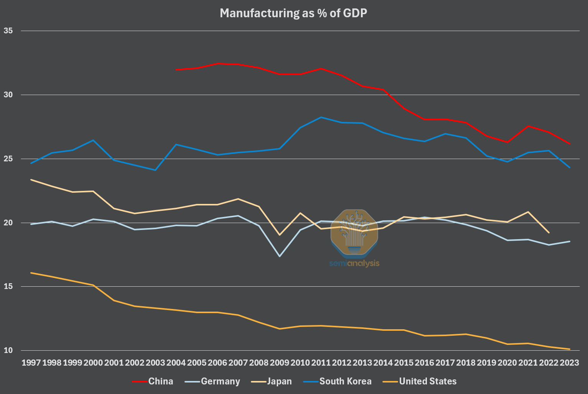

Source: Worldbank, FRED

Our goal with this multi-part Robotics series is to illuminate landscape of the robotics and manufacturing industry, and convey the magnitude of the labor transformation it is poised to unleash. In Part One, we examine the current state of the market and take a deep dive into the hardware architecture of commercially available industrial robots. Our analysis demonstrates that China is rapidly taking over the market, leaving competing nations behind and preparing to capture a revolutionary technology. We also explore the broader repercussions for the Western trailing-edge semiconductor ecosystem.

China’s ascendancy positions it perfectly to lead next-generation robotics—a field we anticipate will generate significantly higher macroeconomic benefits. In Parts Two and Three of our series, we will delve into the intricate hardware and software architectures of next-generation systems and address the remaining challenges on the path to achieving “Robotics AGI” across form factors. We will also pinpoint the likely frontrunners in this emerging market.

For now, let’s start with some basics and explain how why robots are more difficult to build than most understand.

## More Than Just A “Robot”

Robotics is a systems engineering problem with the end goal being a machine, or multiple machines, that can produce one or more human unit of work at equal or lower cost than that of a human. The feat is designing both a system of hardware with many many interconnected individual parts integrated with the software layer, where the software layer understands how to move and plan with the hardware. Repeated iterations are **necessary** to identify the discrepancies between the two systems and resolve them toward perfect accuracy. In essence, this is a delicate dance between two systems, with each iteration of choreography carving synchronicity from complexity. What happens as each etch gets closer to resolution?

Engineering reliability into a system that is low-cost, performant, and scalable achieves a new type of system that has never existed. Comparing a robotic system to a human, the current labor force is lower skilled, lower ability, and a much higher attrition rate. Fusing mechanical capability with a software intelligence brings the world closer and closer to fully expanding the capacities of an industrial economy beyond the constraints of human labor. Similar to humans integrating sensory inputs and cognitive processing to understand and interact with the world, an embodied AI would perform the same actions and operate autonomously, allowing a new group of systems to contribute to all sectors. The imminent robotics transformation is promising to solve all of these and create a new labor force that only movies have been able to depict, but there’s more depth to the field and the industry than the words “embodied AI” might entail.

Operating in this industry has historically been traumatic, from manufacturing capabilities being subpar, to managing a business with a product that is a nightmare to scale, with many bottlenecks constantly in place:

- Limited innovation in hardware throttling accuracy and efficiency in mobility and manipulation
- Software/AI capabilities that never enabled variety among capabilities and real-time understanding
- Exorbitant upfront CapEx for installation
- Elevated OpEx for maintenance of the systems

These have historically combined together to make automation a problem more than a solution. However, breakthroughs in hardware and AI models have finally unlocked the floodgates for early stages of rapid progress and unlocked the potential for general-purpose robotics.

**Subscribe to get notified of all SemiAnalysis articles**

Please verify your email address to proceed.

By subscribing, you agree to the [Privacy Policy](https://semianalysis.com/privacy-policy/) and [Terms and Conditions](https://semianalysis.com/terms-of-service/).

## **Towards General Purpose Robotics**

General purpose robotics is the holy grail of robotics: a robot that can do any task in any environment, replacing the need for a human in the industrial process. Every step along the way the world will see massive unlocks for whoever steps toward general purpose robotics first. The robots currently implemented at scale across the world are rigid and fragile: environments must be predefined and tasks must be static, and any minute change in one factor means the robot will destroy the process. The bottlenecks in place have been impossible to break and stifled the whole industry of robotics for generations, intelligent or not. This meant the only improvements possible have been small, iterative, and incremental developments, and any company who tried to equip robots with anything above the current level of capabilities failed, leaving many researchers and investors sidelined and scarred, especially in Western markets. The only people who tried to cross the chasm into general-purpose robotics have been researchers in a lab. Building a functional replacement for a human that can achieve the same level accuracy as a human, often requiring ~99.99%, and making sure it was worth it in cost over a long enough timespan was a pipedream. Why would anyone believe it?

Not even Google was able to overcome the data scarcity problem, having famously constructed an “arm farm” of 14 robots running continuously for 3,000 hours simply to achieve reliable grasping. This never left the lab. Data scarcity was a crippling challenge. Researchers were forced to build jerry-rigged robots due to the absence of hardware standardization, and then manually gather training data, a process that consumed vast amounts of time and resources.

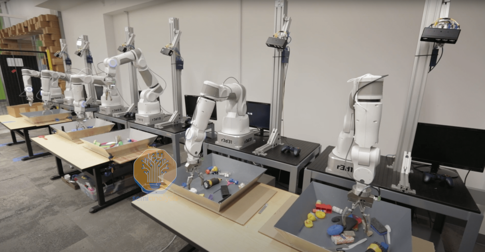

Source: [Google – Large-scale data collection with an array of robots](https://www.youtube.com/watch?v=iaF43Ze1oeI&t=2s)

Moreover, unlike the freely-available textual data on the internet that fueled LLMs, robotics demanded multimodal data, which did not exist. Every person trying to train a robot had to collect all data themselves in physical space with a functional robot. Hardware limitations compounded the issue. It was incredibly difficult to build a system of strong enough actuators that could fine-tune movements, all interconnected with non-standardized parts that don’t understand each other, into a robot that could perform one task with slight variations, and much less one that could perform a wide array of actions.

However, we’re in the early precipice of this nonlinear transformation, but the bedrock the US is standing on is shaky. Significant research and funding across the entire robotics stack have yielded a cascade of breakthroughs. Advances in realistic simulated data, the ability to scale up real world training on multiple robots, and the rise of foundation models have opened the door for a more intelligent system. Simultaneously, advancements in hardware, like electric actuators, have brought down costs greatly and given robots better efficiency to operate at the desired accuracy level, unlocking new actions that were impossible before. **General-purpose robotics has finally been unlocked as a potential real world solution.**

The first movement toward general-purpose robotics will be the entrance into “partially unstructured” domains – initially within their usual environments. In factories, this means operating outside of their isolated predefined environment and handling more than one task. As robots slide across the spectrum toward general purpose, they will replace more and more difficult and diverse tasks in factory settings until they can automate every step.

An even more difficult domain for robots is the human-populated domain, in which robots are considered intelligent/safe enough to operate in wholly unstructured and dynamic environments. Since human behavior is unpredictable, robots will need to adapt to avoid safety risks. In addition to full automation of industry, these robots will ease staffing shortages in elder care, improve hospital efficiency, enhance surgical accuracy, and automate dangerous construction tasks, thereby capturing nearly all labor demand.

## China Is Already Living In Another World

Due to Chinese governmental investment and strategic declaration to accelerate robotics, the country has created incredible processes all while still under the usual rigid and fragile constraints of robotics systems. While still requiring perfectly structured environments and static tasks, China has implemented fully “lights-out” factories. Xiaomi’s “[lights-out](https://itc.ua/en/news/xiaomi-s-new-smart-factory-will-operate-24-7-without-people-and-produce-60-smartphones-per-minute/)” factory operates round-the-clock producing one smartphone per second – with zero humans employed. This is not the only [one](https://www.mobileworldlive.com/u-joy-cities-the-worlds-largest-5-5g-native-lights-out-factory/) [either](https://www.gsma.com/solutions-and-impact/technologies/internet-of-things/digital-industries-20/benefits-use-case/foxconn-lights-off-factory/), China is able to achieve this level of automation without general purpose robotics, and the implications for their production capacity when general-purpose arrives cannot be understated. This is not a statement that the US is losing, this is to demonstrate an absurd difference in manufacturing proficiency. This has nothing to do with cheap Chinese labor, this is a manufacturing country with a robust industrial base that has now created one single machine that can produce goods entirely autonomously. General purpose robotics would make this indistinguishable from a living organism, with mobile robots constantly moving around and solving tasks to support and keep the organism alive and functional.

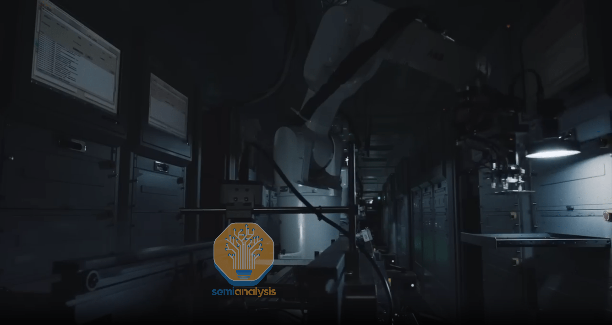

Source: [Xiaomi](https://www.mi.com/global/discover?videoid=2954)

This is only the first step in creating entirely automated machines to produce goods, and they will evolve as AI foundation models become more reliable and accurate. The country has already enabled robots to build robots at their KUKA [factory](https://www.yicaiglobal.com/news/robots-build-robots-at-kukas-guangdong-facility-producing-one-every-half-hour) in Guangdong, and a director at KUKA said that they should be able to cut times from one robot every half hour to one robot every one minute. They’re right. All of these aforementioned factories are running on either minimal levels of AI or the usual structured environment with static tasks and basic programming. General purpose robotics will turn this business into one single machine, and soon after, any complex manufacturing task could be completed by a general purpose robotic system.

## **From Industrial Robots to Cobots**

Let’s take a step back and first understand the current state of the industry. There are many types of robots and form factors that have become much more diverse and feasible in the last few years. The robots that have been most compelling for implementing automation at scale for the past decades however have been the industrial robots.

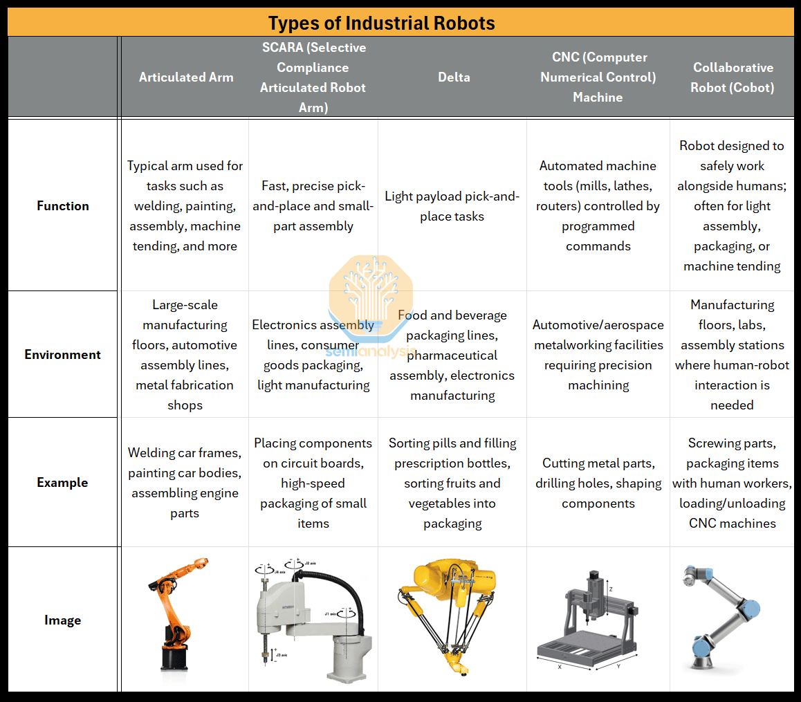

Source: SemiAnalysis

Traditional industrial robots, like an articulated robot arm, prioritize speed, precision, and payload capacity. Equipped with high-torque actuators and finely tuned high-frequency control systems for precision, they are typically found in heavy industry environments that require repetition and high throughput, i.e. automotive factories or electronics manufacturing.

They are required to work in [isolated cells](https://www.youtube.com/watch?v=RBlGe12UGVI) for two reasons:

1. Human safety,
2. Their lack of flexibility.

These robots are not capable of adaptation: any small deviation in the environment can break their process. For example,in automotive industries, [spot welding metal panels](https://www.youtube.com/watch?v=gWwNsgw24NE) together is often automated. This task requires remarkable accuracy to ensure the panels are correctly positioned next to each other, the spot weld is exactly over the designated points, and the weld is applied with the same consistent force and duration **every time.** Due to the accurate nature of the task, any slight deviation in the positioning or timing can affect the weld, and consequently the structural integrity of the vehicle

Source: [KUKA’s automated spot welding](https://www.kuka.com/en-de/applications/automated-welding/spot-welding)

Collaborative robots (cobots) are the proposed solution to a human populated environment subject to the inherent dynamism of the world – enabling a higher level of automation inside a factory. Similar looking to an industrial robot but a bit smaller, they trade-off payload capacity with higher safety, flexibility and programmability – and can easily be restaked and moved around a factory when necessary. These are often the robots that are given higher levels of AI capabilities for some tasks today (higher variability pick and place and sorting).

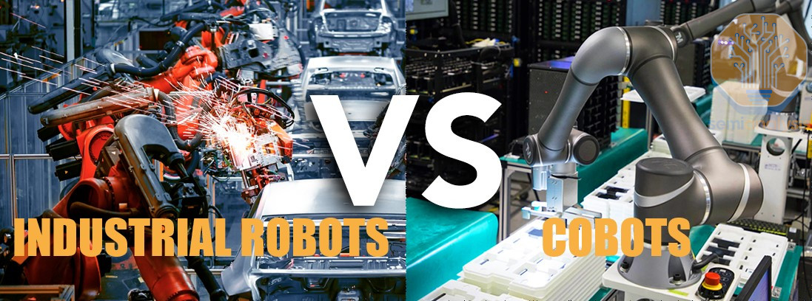

Source: Futura Automation

Cobots sacrifice payload capacity and speed with weaker actuators and adding some type of safety hardware in place such as force-torque sensors to understand collision, additional vision sensors to build a more comprehensive view, and more onboard controllers for redundancy. They can be hand-guided or taught via some interface (tablet typically) so that programming an action requires less expertise and enabling them to easily change simple tasks.

Typically given the tasks that require less force and more finesse, cobots (collaborative robots) might be tasked with lightweight materials handling in between processes in a factory where the industrial robot would take the materials and perform the heavier tasks. Cobots can also work as a companion to other industrial machines like [CNCs](https://en.wikipedia.org/wiki/Numerical_control) (Computer Numerical Control) – where they can [load](https://www.youtube.com/watch?v=lNeRrsu4s3Y) the CNC with raw materials, retrieve the finished parts, and even perform routine supporting tasks like cleaning or quality checking. We show below an example of a robotic arm interacting with a CNC machine.

Source: Productive Robotics

Naturally, the share of cobots of all industrial robot installations has been rising fast, as they enable higher automation settings and improved factory ROI. Cobots are financially viable in industrial settings, as the environment can be structured enough to make sure the robot’s accuracy on tasks remains high. At the moment, there are **over four million robots installed and operating around the world**, with 90% of annual shipments being standard industrial robots and [10%](https://ifr.org/img/worldrobotics/Press_Conference_2024.pdf) cobots. Industrial robots are usually implemented in automotive sectors, packaging in food and consumer goods, and electronics manufacturing. Cobots are seen in the same industries performing more complex tasks that require great precision, but under the guidance and instruction of human workers

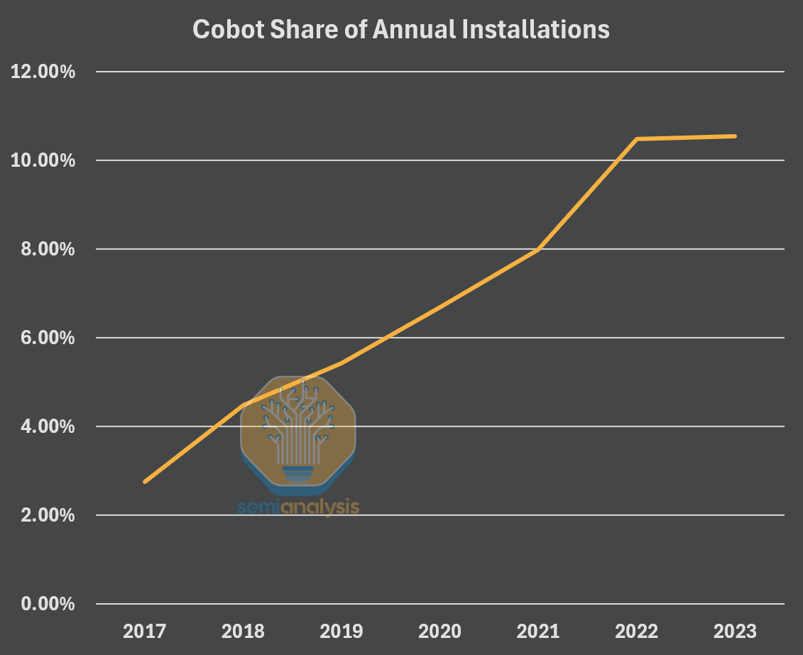

Source: SemiAnalysis, IFR

While the scale of automation is impressive, there are reasons these robots are nearly always found in factory settings. Not all manufacturing is easy for these robots, high-mix low-volume production where frequent changes are common make it difficult to fully automate tasks and most tasks that require fine motor skills and dexterity require levels of manipulation not developed yet. Cobots are posed as the solution for this as well, but in practice, automation entails much more flexibility and capability than any of the current robots can provide.

## **The Rise of Mobile Robots**

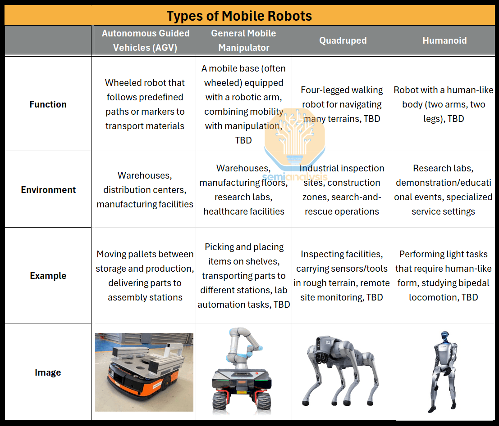

Source: SemiAnalysis

Mobile robots have been the newest addition to the robotic fleet of automation, leveraging mobility to conduct transportation tasks and coordinating with other robots, however, all have different difficulties, domains, and advantages in their mobility capabilities. Autonomous Guided Vehicles were the first foray into mobility around the same time as cobots. Their job is simple: transport objects, like a package inside of an Amazon fulfillment center, to another location. These are still rigid as most other robots, requiring that some guidance be placed on the floor for the AGV to follow.

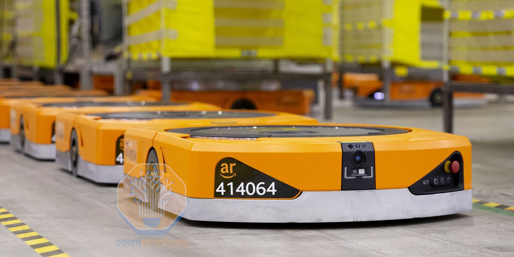

Source: Amazon

Mobile manipulators are often wheeled manipulators that are found in factories, where floors are legally required to be flat, and will be used for grasping and moving objects from station to station on a very strict and short navigation horizon. Quadrupeds are four legged mobile robots and are more often found in more open-world environments, typically found inspecting various areas of a construction site or similar, however, they are still in the prototyping phase as well. Finally, humanoids are able to be in the same environments as the others, but are poised to be functional in human-populated domains. These are currently in production with the aim of being an evolved and more capable mobile form factor with more degrees of freedom, range in tasks, and domains, but have yet to be integrated into any formal setting.

However, all of these form factors still only function in static structured environments. At the moment, mobile manipulators are still in the early deployment phase in factories, and quadrupeds will soon begin deployment onto construction sites. Currently, only AGVs are widely deployed and integrated, and mobile manipulators, quadrupeds, and humanoids are still in early formats of more open-world domains, benefitted by the current progress in AI.

## **Hardware: What Goes Into a Robot?**

Robot component markets are dominated by a few key players, and the US is noticeably absent in many. The industrial capacity necessary for entry—high volume, high quality, and low cost—is largely concentrated elsewhere, particularly in China. It will be a challenge for the US to carve a position, especially when most of the materials come from China.

On the hardware side, actuators, motors, and drives are the pieces that will physically generate motion by converting an electrical input into either a hydraulic, pneumatic, or, more often, electrical output to generate this motion.

At the higher-level in a factory, a Programmable Logic Controller (PLC) determines how a production line will be automated, sequencing each operation properly to ensure the entire automated process is functional. Within each robot, regardless of form factor, there is a Microcontroller Unit (MCU), or embedded systems with multiple MCUs, that is the dedicated processor handling low-level real-time tasks like reading sensor inputs, generating motor control signals, and running fast control loops. These systems are effectively the “brain” for most robotic systems.

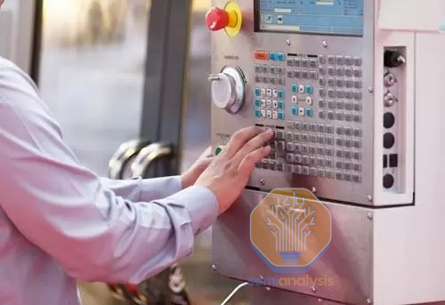

Source: BizLink

In the world of robotics, high-precision motors are required to ensure the proper torque is applied to avoid damaging its surroundings. Servo motors are the most common option – they are self-contained systems that include a motor, a control circuit, and a feedback mechanism. This overhead enables the motor to actively adjust itself and maintain a desired position or motion. Servo motors are one of the few components in a robot where the market is not dominated by China and fairly well distributed across countries.

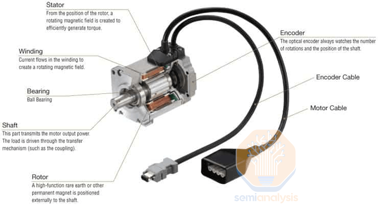
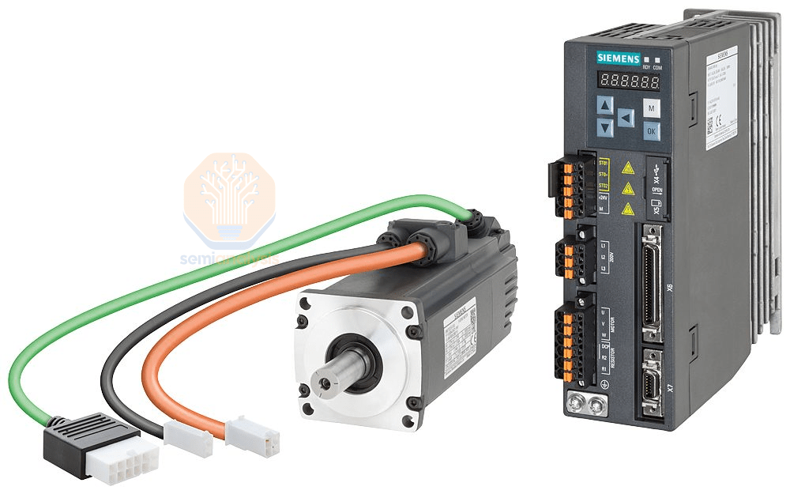

Source: [SolisPLC](https://www.solisplc.com/servo-motor)

The control circuit is referred to as “drive”. This is a power electronics box designed to regulate the voltage sent to the motor, through an AC-DC-AC conversion (or AC-DC for a DC motor). Its main component is a power electronics switch such as a MOSFET or IGBT, which combined with a rectifier and capacitors can electronically modify the electrical signal.

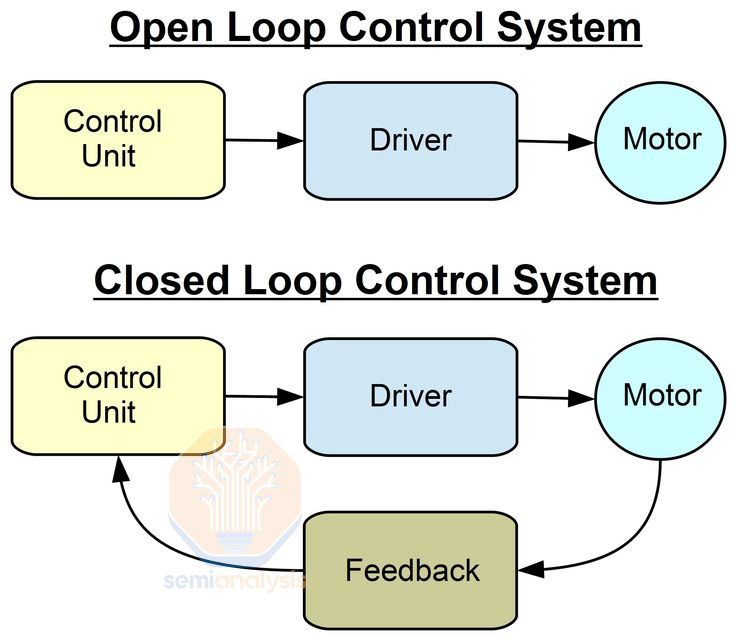

Source: Polytechnic Hub

Gearboxes are also a common component found in servo motors. They are able to increase the force/torque of a motor, and increase accuracy. In essence, gearboxes reduce the speed of a motor, leading to a proportional increase in torque, which also enables the motor to make finer movements. Most gearboxes found in robotic systems have been largely produced by Japan’s Nabtesco.

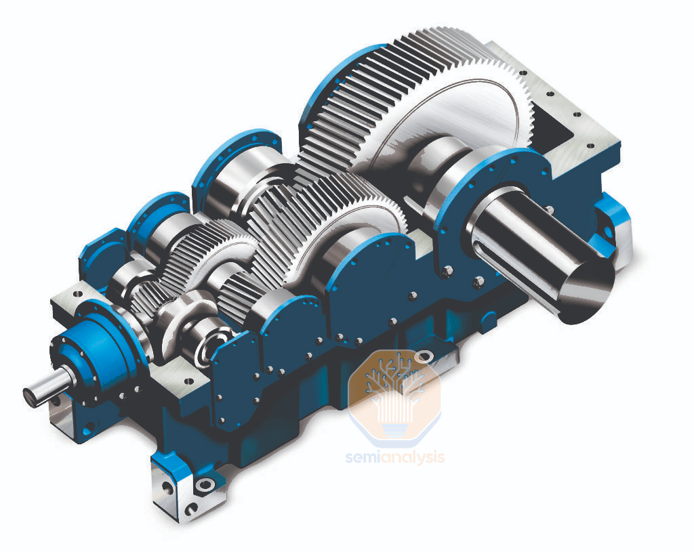

Source: [Santram Engineers](https://www.santramengineers.com/industrial-helical-gearbox-issues-and-their-solutions/)

Cameras and sensors are pivotal for the robot as well, as this has been the primary medium by which it knows both its own positioning and the steps required to complete the task it faces. Most industrial robots use standard machine vision 2D cameras, 3D depth cameras, or a combination of both to create a full spatial understanding of its environment. Though they are trending toward mounted, lighter-duty, cheaper cameras with stronger software to fill the gaps. Some form factors, typically those in a more human-populated environment, may use LiDAR to gain a much more detailed view of its surroundings, albeit usually at a higher cost. Most LiDAR, automotive specifically, comes from Hesai (China), and China has advanced enough in LiDAR innovation that Unitree has already developed a proprietary [LiDAR](https://www.unitree.com/L2) system at a slightly higher price point than the Intel RealSense depth camera.

Industrial and precise robots are equipped with joint encoders, which allow the robot to understand the angle, position, or rotation speed of its joints. A broad set of sensors can be included such as touch and tactile sensors to understand pressure, texture, and more, proprioceptive sensors to understand physical internal states like balance, force-torque sensors to understand how much force-torque is being applied by a joint, etc. This market is a bit small/disjointed because the products are newer developments; however, most Western companies that are able to design and assemble these sensors will still typically buy the base materials from China.

Source: Intel

Then there are the “end-effectors”, which are whatever the robot may have at the end of its arm, typically a tool or a very basic gripper for most robots. Each end-effector has its own use-case and payload capacity, or the amount of weight it is able to “hold”, so whatever the purpose of the robot will dictate the end-effector it has installed. This is one part of the robot that China is not very involved in at all, most end-effector producers are German (Schunk, Zimmer Group, Festo, Schmalz) and some are even American (ATI Industrial Automation, Destaco). However, it’s likely that Chinese companies are simply producing their own end-effectors and not exporting them yet, as vertical integration is their main strategy. While “hands” are catching much of the spotlight right now, these are not widely implemented and are far from achieving sufficient dexterity. We will explore the challenges of dexterity and what road lies ahead for manipulation in the next article of the robotics series!

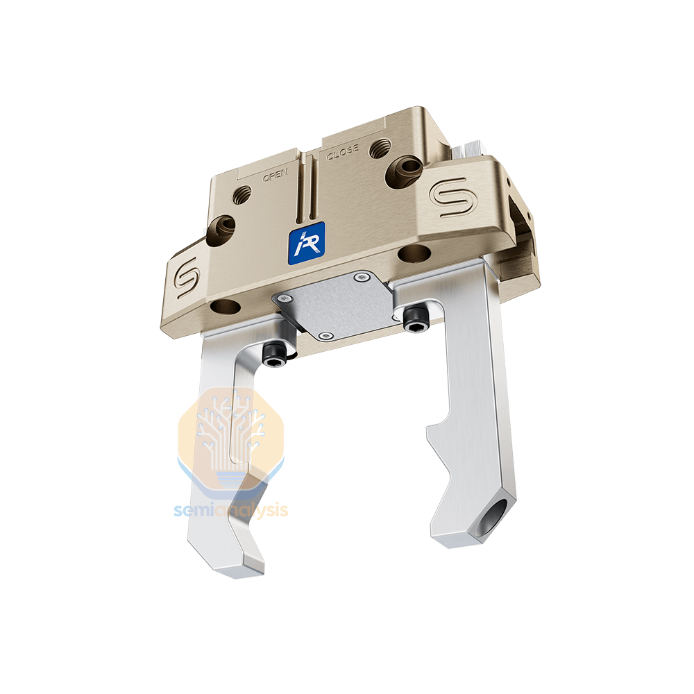

Source: IPR Worldwide

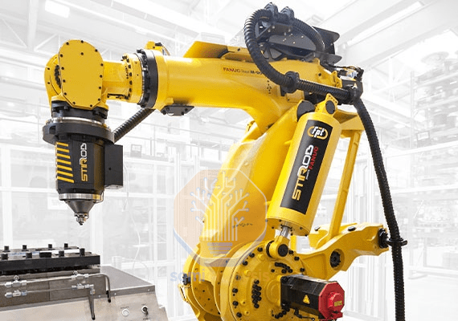

Source: Igus

**Subscribe to get notified of all SemiAnalysis articles**

Please verify your email address to proceed.

By subscribing, you agree to the [Privacy Policy](https://semianalysis.com/privacy-policy/) and [Terms and Conditions](https://semianalysis.com/terms-of-service/).

## **Supply Chain Woes**

*Thanks to our friends at [Silverado Policy Accelerator](https://silverado.org/) for highlighting this Substantial Transformation Principle obfuscation!*

In the US, the “Made in America” label is misleading at best, and downright harmful at worst. The substantial transformation principle allows for significant processing of foreign materials, notably from China, in intermediary countries, before final assembly in the US. This means a product can be labeled “Made in USA” even if its core components originated in China, obfuscating the true extent of foreign dependence. Consequently, many US companies will purchase cheap materials from China, transform them into robotics hardware packaged with Country of Origin (COO) America, and undercut the US firms that are actually extracting from the ground and manufacturing in the US. This is hard to talk about, but it’s even harder to solve.

It is far more difficult and time consuming than many people think to bring manufacturing capacity online and mass produce industrial robots to introduce automation, and worse, it’s *very* time consuming. Supply chains for many industrial robots are very complex, coming from many corners of the world where component production is typically already dominated through competitive cost advantages. There have been many cases of supply chain disruptions that have rattled Western economies. For example, in 2020-2022 during COVID the ports of Los Angeles and Long Beach experienced a line of over 100 ships waiting outside the port for their turn to disembark. In stark contrast to this debacle, during the same time period (2020-2021), China pivoted and increased their robotics installation by [44%](https://ifr.org/ifr-press-releases/news/china-robot-installations-grew-by-44-percent) from 2020-2021 in order to implement automation to make up for the lack of a workforce.

Why didn’t the US follow suit? COVID was the largest wake up call in years regarding the supply chain dependencies, yet the country refused to open its eyes. As explained below, the US has no significant market share in **any** of the relevant manufacturing nodes for robotics, and in most it’s essentially absent.

## **Mechanical Components: Gearbox, Motors, Actuators**

On the hardware side, we will focus on what actually goes into generating locomotion in a robot: actuators/motors and their respective components. **There are many types of motors available for generating motion, steppers with precise angular control in open-loop systems typically found in 3D printers or CNC machines, brushless DC motors with high power-to-weight ratios to propel drones and EVs, but the most important in robotics tends to be the servo motor.** Most robotics companies, especially those of the Big 4, produce their own servo motors in-house and sell them individually as well. These are not terribly difficult to build, but manufacturing them at scale does create a bit of a moat for the aforementioned reasons: actuators must have incredible reliability and performance, so scaling up requires advanced manufacturing techniques to be nearly perfectly replicated. As such, the long-standing manufacturers of robotics components with the necessary expertise hold the largest market share are Yaskawa (Japan), Panasonic (Japan), Bosch (Germany), KUKA (now China), and Siemens (Germany). Rockwell (USA) must be named here as well because it holds some 7% of the servo motor market share, but this is also the only segment of the supply chain that is not dominated by any one player.

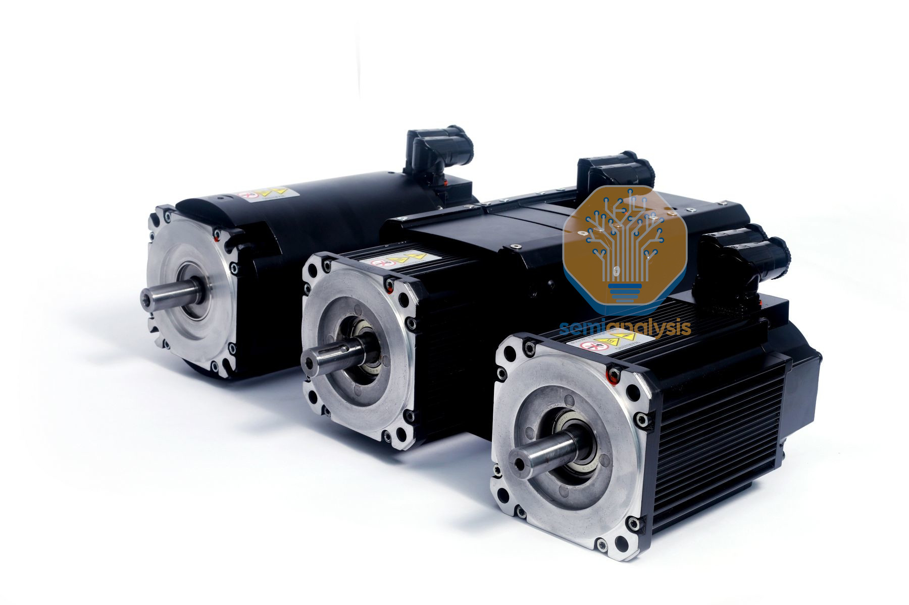

Source: Moog GmbH

Nearly 60% of the world’s gearboxes for medium-to-large industrial robots are supplied by Japan’s Nabtesco. Their difficulty to manufacture arises from the fact that almost every order is likely to be highly customized and tailored to the customer’s hardware specifications, yet must still meet the 99.99% accuracy threshold to replace a human.Gearboxes are absolutely pivotal for ensuring this precision, and therefore make up the largest % of COGS on an industrial robot at [14%](https://www.controleng.com/industrial-robot-value-comes-from-servo-motors-servo-drives-and-gearboxes/). The manufacturing of these gearboxes must be accurate to an unreal degree, and as such, typically only long-standing and established players with years of experience building them have refined their process and process technology enough to achieve this quality, hence the Nabtesco dominance. They manufactured their first cycloidal gear in 1980.

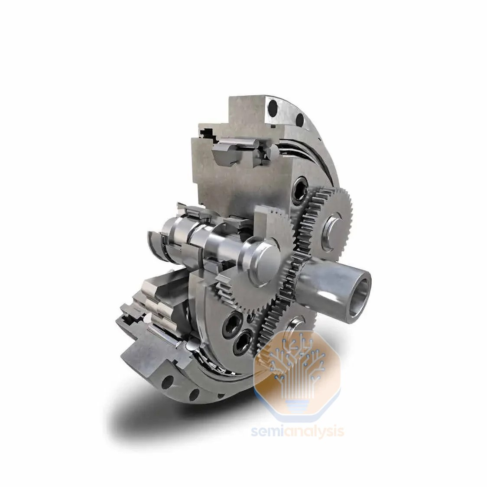

Source: CuratedIndustry

There are even special types of gearboxes like Harmonic Drive (Japan), founded in 1970, which uses a patented strain-wave design for incredible precision. These are more expensive but a must-have in superprecise settings (like semiconductor fabrication) and as such have a strong presence at [15%](https://roboticpaint.com/how-japanese-speed-reducer-monopolize-the-industry/) of the gearbox market. However, to demonstrate what a proper industrial base and rapid iteration is capable of, Leaderdrive was founded in China in 2003 with the aim of manufacturing their own superprecise strain-wave gearbox. In just 14 years, the company had produced over 100,000 units and captured [90%](https://www.leaderdrive.com/about-us.asp) of the Chinese domestic market for strain-wave gearboxes.

Source: [makeagif](https://makeagif.com/gif/strain-wave-gear-principle-harmonic-drive-ag-yLZhgu)

## **Magnets and Materials – Manufacturing Dependence**

Motors and gearboxes are not in short supply and are fairly cheap; however, motors nowadays have undergone a breakthrough. Most high-quality high-speed motors are now developed with permanent magnets (PM motors) to achieve higher power efficiency and power-to-weight ratio — perfect for robots. Without getting into too much detail, permanent magnets effectively add more magnetism into the electromagnetic field of a motor, meaning less electricity is required to magnetize and can instead go toward generating motion. There remains one issue though, the process and elements that go into creating your typical Neodymium permanent magnet (NdFeB) is nearly entirely dominated by China with 90% of the market share. Of that 90%, roughly three producers in China hold a near-monopoly on it: Jingci, JL MAG, and Ningbo Yungsheng.

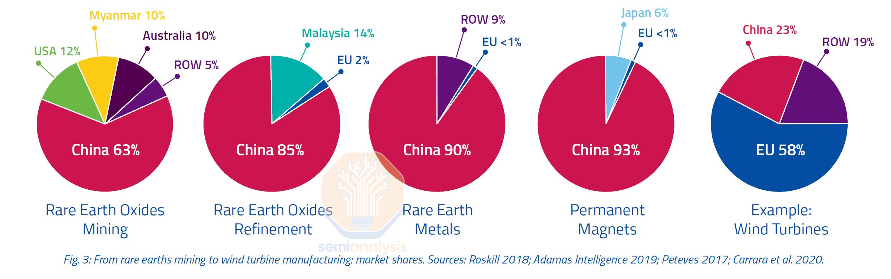

Source: ERMA

While “rare earth” is a misnomer — they are just as abundant as most other elements– the process needed to refine Neodymium and produce a final permanent magnet requires around ~12 complex steps and a strong industrial capacity. China dominates this process as well at 93%. After the trade restrictions on [Chinese strategic minerals](https://www.reuters.com/markets/commodities/rattled-by-china-west-scrambles-rejig-critical-minerals-supply-chains-2024-12-06/), there are attempts to try to minimize this dependency on Chinese permanent magnets. For instance, MP Materials in the US to become the only fully vertically integrated rare earths company in all of North America. Australia’s Lynas, the world’s largest non-Chinese producer, is expanding and building another separation plant in the US with US DoD support of [USD$120M](https://lynasrareearths.com/lynas-awarded-us120m-contract-to-build-commercial-heavy-rare-earths-facility/), and the DoD doubled down in 2023 with another [USD$94M](https://www.sccommerce.com/news/e-vac-magnetics-build-first-us-facility-sumter-county) investment in e-VAC’s Sumter County, SC plant to produce NdFeB permanent magnets. The US is concerned with a dependency on China for rare earths, but resolution is slow. While MP Materials went from construction to early production in a few years, actually establishing high-volume capacity requires a [5-10 year timeframe](https://www.gao.gov/assets/gao-10-617r.pdf).

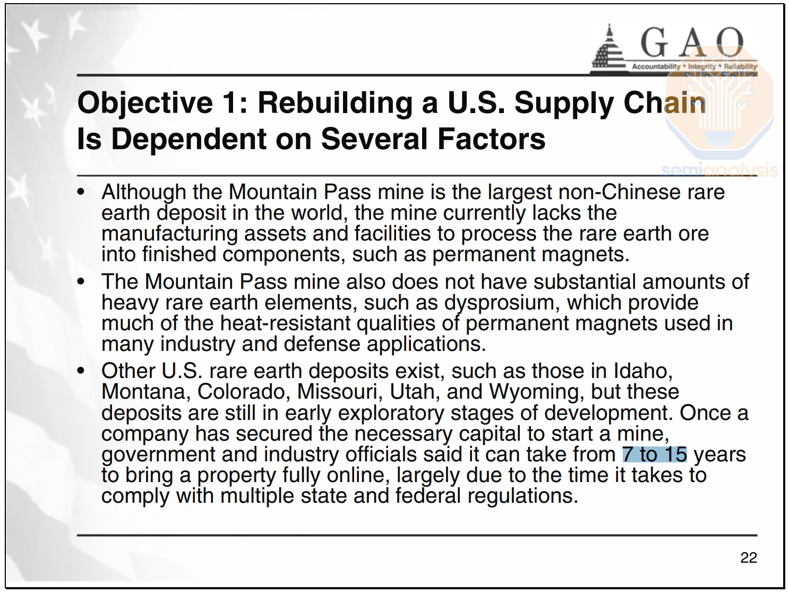

Source: GAO

However, it’s likely that these companies will not catch up in scale without *significant* government subsidy to match the lower cost of capital in China. We’ve heard rumblings that China has some 250-275K tons of installed capacity for refining NdFeB magnets, and this will likely double in the next five years. For comparison, the USD$120M investment from the DoD in Lynas will likely produce somewhere around ~4,200 tons of refined REEs. At the moment, China’s economies of scale has given the country a nearly unshakable monopoly on the rare earths market.

Mining and materials beyond rare earth elements are just as — if not more essential, and while this is not typically bottlenecked, they are largely under the control of China. Additionally, having raw ore deposits or being capable of mining doesn’t imply too much for many of these elements. Many economies struggle to process these elements whereas China excels in this endeavor due to its advanced industrial economy. Stemming from two main initiatives in China, the Belt and Road initiative and Made in China 2025 initiative, the country has invested and built a well-paved path to absolute dominance over nearly the entire minerals processing industry.

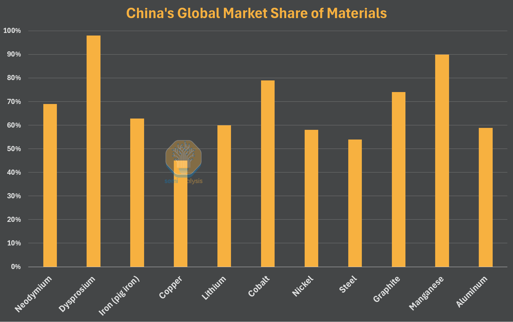

Source: SemiAnalysis, Industry Estimates

## **Lithium and Batteries**

All of the ore may come from other countries rich in deposits, but this means nothing without the capacity to refine them at scale and with high enough grade. In fact, China is only rich in deposits in *two* of these minerals, lithium and graphite, but countries rely on Chinese processing to refine them into usable materials. The Belt and Road initiative came up with clever ways to circumvent the lack of mineral deposits.

- Copper typically comes from Chile and Peru, and around 76% of Peru’s and 68% of Chile’s copper exports went to China, totaling up to 56% of all global raw [copper](https://features.csis.org/copper-in-latin-america/).
- Nickel is highlighted as the one key mineral that is not refined mostly in China, as 37% is refined in Indonesia, and “only” 28% in China. However, according to the most recent [IEA](https://iea.blob.core.windows.net/assets/ee01701d-1d5c-4ba8-9df6-abeeac9de99a/GlobalCriticalMineralsOutlook2024.pdf) report, over 80% of Indonesia’s battery-grade nickel output is owned by Chinese producers linked to the [CCP](https://c4ads.org/commentary/refining-power/).
- Cobalt is mined in the Democratic Republic of the Congo and accounts for [80%](https://issafrica.org/iss-today/rampant-cobalt-smuggling-and-corruption-deny-billions-to-drc) of the world’s cobalt production, but China has struck up the Sicomines Pact with them and now owns [80%](https://www.cecc.gov/events/hearings/from-cobalt-to-cars-how-china-exploits-child-and-forced-labor-in-the-congo) of the DRC’s cobalt output.

China understands that without access to processed minerals, there is no first step to manufacturing a product. The Western nations have not woken up to the fact that reshoring manufacturing starts at these minerals.

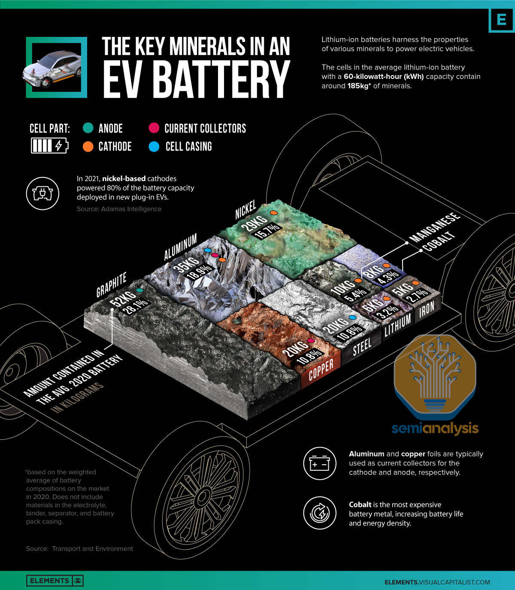

Source: [Visual Capitalist](https://elements.visualcapitalist.com/the-key-minerals-in-an-ev-battery/)

Batteries, lithium-ion specifically, are critical for mobile robots, like drones, service robots, autonomous guided vehicles in warehouses, mobile manipulators, humanoids, and especially EVs. If you wanted to realize the future of detaching robots from a connected power source, you’d most likely equip it with Chinese battery cells, as Chinese companies supply around [80%](https://www.bloomberg.com/graphics/2023-breaking-china-ev-supply-chain-dominance/?embedded-checkout=true) of battery cells globally. Chinese battery packs maintain an advantage by having a cost of around $127/kWh, while North America and Europe see prices 24% and 33% higher [respectively](https://www.bnef.com/insights/30265/view). The largest producer, CATL, accounted for [37%](https://www.slashgear.com/1600609/who-dominates-ev-battery-market-why-important/) of the global EV battery market in 2023, while BYD accounted for ~16%.

The largest producer outside of China, LGES (South Korea), only accounted for roughly 13% of the global market share. It’s not easy to overcome the barriers to entry in this market, Sweden’s state-backed attempt to break the dependency, Northvolt, just filed for [bankruptcy](https://www.ttnews.com/articles/northvolt-investment-fund). While the US was committing at least ~USD$73B to battery supply chain investments with the Inflation Reduction Act, China was giving out over USD$230B in subsidies to EV companies since 2009. The current layout of the battery market is a bit scary, given that Chinese companies can and will be iterating faster than Western companies due to the massive industrial base in China and continued government investment which will only further drive their costs down to edge out competitors.

Building a battery from an engineering standpoint is a hurdle that Chinese companies have been able to climb over their repeated iterations. The balancing between complex chemistries within cathodes, anodes, and electrolytes must all meet stringent purity requirements as any impurity can lead to noticeable variations in battery lifetime. Constructing sufficient capacity to produce at scale is already challenging, especially in US, and can cost over USD$100M in the US to construct, which is [46%](https://evboosters.com/ev-charging-news/300-billion-in-new-lithium-ion-battery-gigafactories/) more expensive per GWh than its Chinese counterparts. LG has even paused the construction on their USD$5.5B battery plant in Arizona citing “[market conditions](https://www.utilitydive.com/news/lg-pauses-arizona-battery-plant-energy-storage-queen-creek/720416/).”

In the case of robots, batteries are all different sizes, there is no standardization, and the batteries have different demands. Power-to-weight ratio is a much stricter requirement as a robot doesn’t have the leniency to carry the same weight a car would, and often different robots have different power requirements. The battery that a quadruped would use is not the same battery that a humanoid would use, and this extends to nearly all form factors. The difficulty and cost in manufacturing a pure and efficient battery is already challenging enough, especially in the US, but the lack of uniformity in robot batteries will be one of the largest issues as the time arrives to scale production**.**

**Subscribe to get notified of all SemiAnalysis articles**

Please verify your email address to proceed.

By subscribing, you agree to the [Privacy Policy](https://semianalysis.com/privacy-policy/) and [Terms and Conditions](https://semianalysis.com/terms-of-service/).

## **Historical Robotics and How The Current Powers Came To Be**

Industrial automation through robotics has been long in the making over the past decades, and throughout this time, some countries have prevailed as paragons of what the automated future can look like, and some have lost their position. Let’s take a look at the current world powers, where they stand in the robotics race to automation, and the driving forces moving their markets. So how did the world leaders in robotics end up on top?

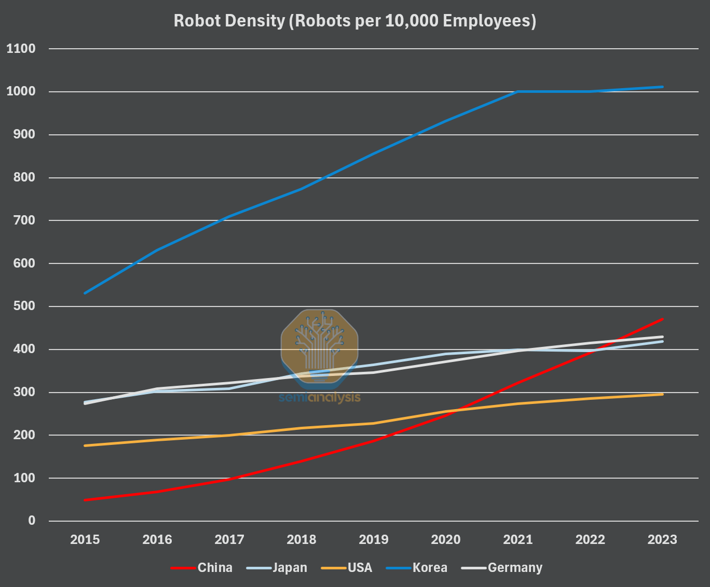

Source: SemiAnalysis, IFR.org

The Robotics landscape has historically been dominated by four countries: South Korea, Japan, Germany, and the US. China today is a major force, but we will deep dive into the country later in the report. A closer look at the four incumbents reveals common factors driving their success to varying extents:

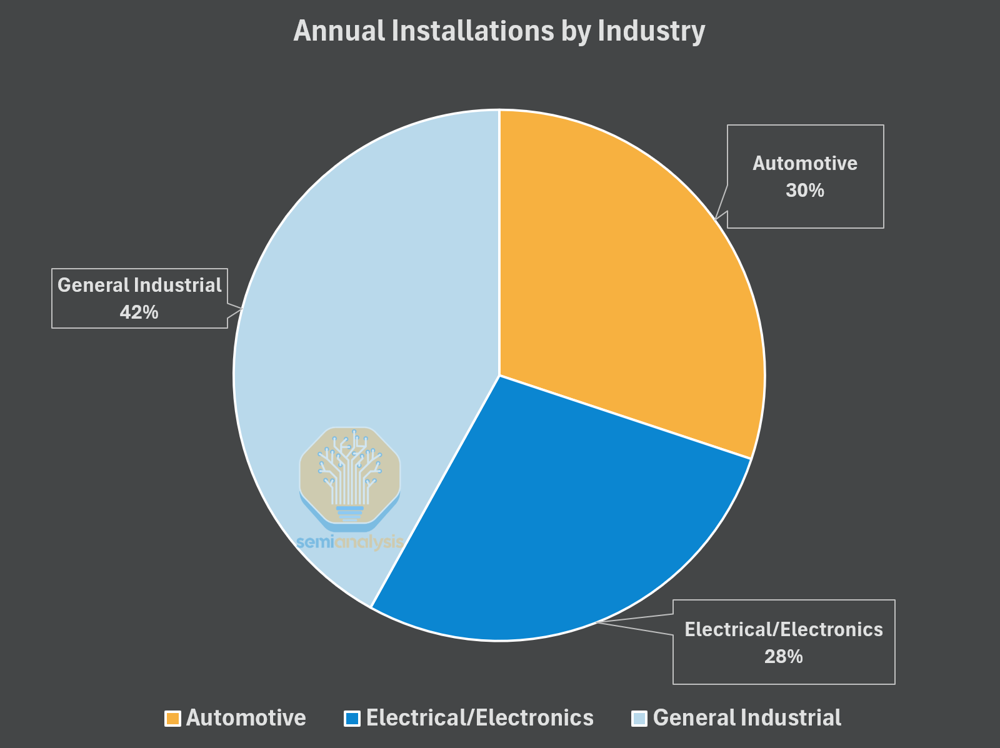

Source: SemiAnalysis, IFR.org

- Heavy industries: they are all historically large players in heavy-duty industries like Automotive and Electronics – which are prone to automation through robotics.
- Presence of vast industrial conglomerates – the likes of Toyota, Siemens, Samsung, Emerson
- Technology-savvy culture
- Demographics and labor cost

## South Korea and Japan: Can’t Automate Birth Rates

South Korea has taken automation to an extreme level, with 10% of the workforce being automated! With high-tech manufacturing companies making up a whopping [61%](https://www.statista.com/statistics/1490388/south-korea-total-assets-of-major-chaebols-as-percentage-of-gdp/) of the Korean economy in 2022, it has a clear advantage. But cultural factors are also at play – for example, eCommerce adoption is among the world’s highest, with [north of 30%](https://www.emarketer.com/content/global-ecommerce-share-breakdown) of retail sales done online, double that of the US!

And the South Korean government and Chaebols are all-in: In 2021, Samsung declared their company-wide initiative to invest up to [USD$163B](https://www.koreatimes.co.kr/www/tech/2025/02/129_389731.html) into industrial automation and AI. Hyundai already acquired Boston Dynamics in 2021. LG set robotics as a key growth area after deploying self-driving airport guide robots at the Seoul airport in 2017, and recently just converted their stake in [Bear Robotics](https://www.lgnewsroom.com/2025/01/lg-acquires-majority-stake-in-bear-robotics-to-bolster-robotics-capabilities/) into a majority stake. On top of all of this, the government is upping their investments as well. In total, the country has put forth four rounds of the Basic Plan for Intelligent Robots since [2008](https://ifr.org/downloads/papers/Executive_Summary_-_World_Robotics_RD_Programs_V03.pdf)–[2030](https://ifr.org/downloads/papers/Executive_Summary_-_World_Robotics_RD_Programs_V02.pdf), totaling USD$1.6B, and a new plan to invest ~USD$2.26B in the industry up to [2030](https://www.koreatechtoday.com/south-koreas-2-26-billion-vision-a-robotic-revolution-by-2030/). While the country needs automation more than ever, it doesn’t have the benefit of being a major manufacturer, having relied on other countries for [~60%](https://www.korea-certification.com/en/south-korea-still-depends-heavily-on-imported-robot-components/)of components in an industrial robot. South Korea is running on borrowed time.

South Korea has found automation to be a necessity for the same reason as Japan: an aging labor demographic and low birth rates. Despite government initiatives across the board, the country continues to hit record-low birth [rates](https://asiatimes.com/2025/02/japans-birth-crisis-is-a-leadership-failure/). Case in point, the dearth of workers in rural areas is forcing factories to [move](https://www.chosun.com/english/national-en/2024/01/12/53W4QPBZORCCVF5HRX3DCHYOYI/) near Seoul just to man their operations. They’ve even recently had to [remove](https://www.kedglobal.com/construction/newsView/ked202402140025) their decades-old foreign worker ban at certain manufacturing plants (in place due to security reasons) to make up for the labor shortage. Korea suffers from the lowest birthrate in the world, with Japan trailing closely behind. However, Japan stands a slightly better chance in the race to automation as they have two of the Big 4 titans, while Korea still imports some [~60%](https://www.korea-certification.com/en/south-korea-still-depends-heavily-on-imported-robot-components/)of the components in an industrial robot.

## Germany and The EU: Watching from the Chair in the Corner

Germany, the industrial powerhouse of Europe, holds the position of 4th highest robot density in the world, and has always been geared toward a strong industrial economy. The country introduced Industrie 4.0 to the broader European Union in 2011, aimed at bringing the region to the forefront of integrating new technologies and automation processes into industry to enhance competitiveness. Their heavy emphasis on industrial manufacturing has led them down the path toward great automation, and they would be well positioned for the coming of the robotics unlocks had the EU managed to stop China from eating away at their automation companies.

European countries have been complicit and passive in the selling of the EU’s industrial automation capacity and technologies to China. A travesty that will echo through the robotics revolution, Germany’s stringent and bureaucratic restrictions held them back from interfering on the KUKA take over in 2016, sidelined as it was sold off to China’s Midea Group. They could only [reform](https://a.storyblok.com/f/137553/x/5c5eaafa8f/evolving-fdi-screening-in-germany.pdf) the policy after it unfolded and their goliath was gone. Italy sold off many robotics companies (EVOLUT, OLCI Engineering, CMA Robotics), and in 2022 the country finally made the decision to [veto](https://decode39.com/3551/draghi-efort-robox-veto/) one of the takeovers. Now, in [February 2025](https://www.automation.com/en-us/articles/february-2025/robotics-action-plan-europe-vdma), an automation organization industry finally issued a Call-To-Action to the EU to address its lack of competitiveness through robotics. Industrie 4.0 is a transformational plan, but it took the EU nine years to realize that it required the robots China was eating.

## **The US: The American Dream’s Rude Awakening**

Lastly, in the US, we see a strange phenomenon of having a highly advanced tech sector, but both a lack of national strategy and the drawbacks of outsourcing manufacturing. Manufacturing capacity in the US is still a relevant topic, the issue is that it cannot compete in sectors that China competes in due to the expensive nature of manufacturing in America, and the “quality” moat that the US once had is slowly draining, as China now has the means to produce most goods at similar quality for cheaper. Automating certain sectors could alleviate this pain, but this would be a ways away. The country has a large automotive industry like its peers, but it only ranks 10th in robot density in 2023. One study showed that according to wage-adjusted robot adoption, the US is actually 49% lower than [expected](https://itif.org/publications/2021/01/25/robots-and-international-economic-development/). Given the AI revolution in the country, it’s surprising to see one of the main potential beneficiaries, robotics, diverging from the path of its other tech sectors. Should robotics become a target sector for growth, the country may be able to benefit from the cheaper production and compete, but this is down the line.

There’s a number of reasons why the dissonance could be occurring in the US, a large one mainly being the lack of multi-year national initiatives that other countries see benefit from. For example, the CHIPS act and the [Inflation Reduction Act](https://www.congress.gov/bill/119th-congress/house-bill/191/titles), two major government initiatives aimed at bolstering domestic industry, were initiated under one administration and under another the IRA is already on the table for [repeal](https://www.congress.gov/bill/119th-congress/house-bill/191/titles), with the [CHIPS](https://www.foxbusiness.com/politics/future-chips-act-under-trump-admin) act being in the conversation as well. Moreover, the economy was structured to follow different economic incentives than China.  The US found it more worthwhile to pursue digital innovation, cutting-edge technology, and services, and in the process it outsourced most production capabilities to countries with a better cost advantage as most American companies cannot compete. However, the US is now left at the mercy of Chinese manufacturing powers and will need a significant turnaround just to enter the race.

To add insult to injury, a closer look at the Western world’s automation growth reveals a peak in ~2016-18. Japan’s 2023 additions are still ~13% below the 2018 peak, and South Korea has not grown since 2016. The only country among the top 4 that has reached a new peak in 2023 is Germany… but their goliath KUKA has been acquired by China and is shifting manufacturing to Asia.

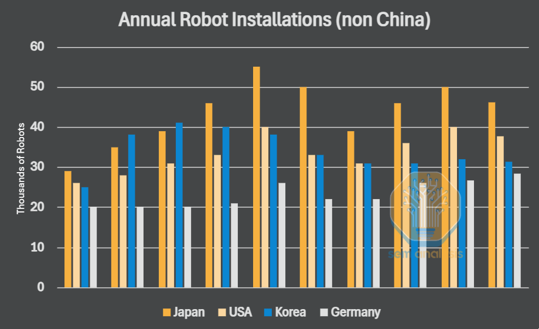

Source: SemiAnalysis, IFR.org

## The Sleeping Goliaths and The Budding Davids

KUKA is part of the small set of companies referred to as the “Big 4” in robotics, having dominated the industry for decades: FANUC (Japan), ABB (Switzerland/Sweden), Yaskawa (Japan), and KUKA (prev Germany, now China).

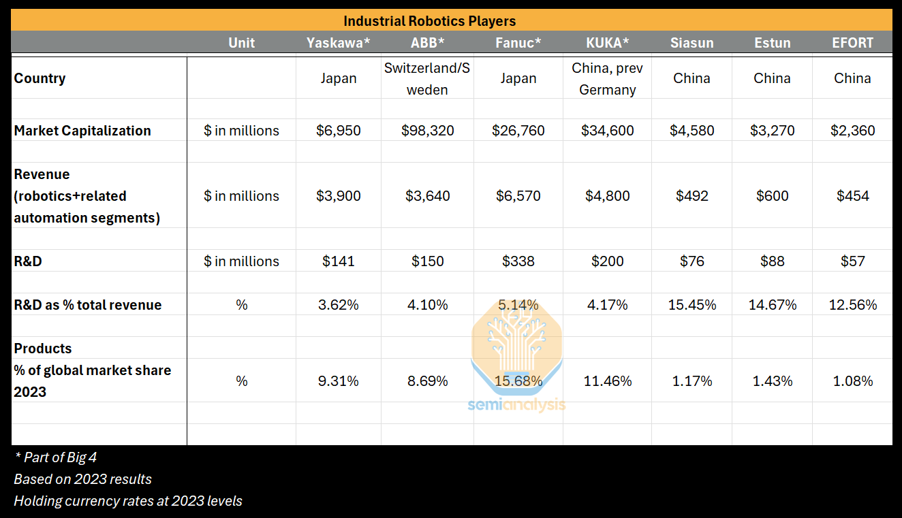

Source: SemiAnalysis

A closer look at those four titans reveals a lot of similarity: decades of experience in the space, high-volume manufacturing capacity among a broad product portfolio (cobots, robots, multiple industries, etc), but relatively low R&D ratio and overall limited willingness to participate in the capital-heavy and risk-oriented goal to build these next-gen robots that hold the same promises that have failed in the past. In addition, their business is increasingly tilted towards mainland China – leaving a large geopolitical risk.

The situation is particularly worrisome, with Chinese players now on track to catch up and fill the gaps with unprecedented speed.

## **China’s Robotics Champions**

While the revenues of the major companies are much larger than those of China, the landscape has been shifting toward western sleeping giants growing complacent and Chinese innovation. Chinese robotics are picking up very quickly through companies like Estun, Efort, and Siasun, and their recent takeovers of the aforementioned European robotics companies.

These companies are setting up to be powerhouses. Most are focused on strong vertical integration, like Estun with up to [95%](https://en.estun.com/?list_180/) of core components manufactured in-house, enabling them to rapidly iterate product development. They recognize the power of a strong production capacity, for example EFORT is planning to build out a “[Super Plant](https://www.yicaiglobal.com/news/eforts-stock-surges-on-plan-to-invest-usd263-million-to-build-robot-super-plant-global-hq)” to upgrade production capacity by 100,000 robots/year. Siasun is already well-equipped for an impressive production output with around 2.3M square footage of factories globally. Furthermore, their R&D numbers may speak for themselves, but Siasun has gone even further in their innovation strategy. The company went so far as to [buy](https://www.chinadaily.com.cn/business/tech/2017-08/24/content_31035917.htm) a leading German mechanical engineering vocational school so that they could both train new employees abroad and gain access to the decades of German experience in training engineers, all while setting up its own robotics institute at a Chinese [university](https://www.xjtlu.edu.cn/en/study/departments/school-of-robotics/industrial-partners/siasun).

The traditional industrial robotics market and the respective hardware is still dominated by the original four giants of ABB, KUKA, Fanuc, and Yaskawa, however, they are not matching the pace of their Chinese contemporaries. Lack of innovation and investment in R&D is leaving a door wide open for Chinese companies to enter through, and they’re only ramping up further. This expansion is not only happening at the company level but rather it’s the country’s imperative to cross the finish line first.

## **China’s Hellbent Path to Robotics Dominance**

In China, the most impressive shifts are taking place, going from outside the top 10 in robots per 10,000 employees in 2018, to overtaking 3rd place in the world from Germany with 470 robots/10,000 employees in 2024. China’s annual root installations dwarf that of the four western incumbents **combined**.

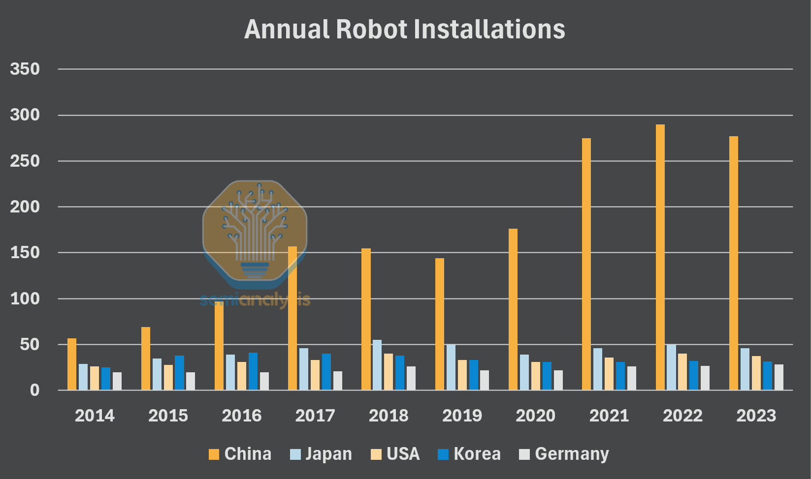

Source: SemiAnalysis, IFR.org

A change of this scale can only be described as a robotics revolution. Many factors can point to how this happened, but most stem from their massive industrial sector and policies that continue to fuel it, like the Made in China 2025 plan, and aggressive government subsidies. Exact numbers are hard to pinpoint, and the EV industry is a key recipient, but it is clear that the broad industrial landscape is benefiting from at least tens of billions of dollars every year.

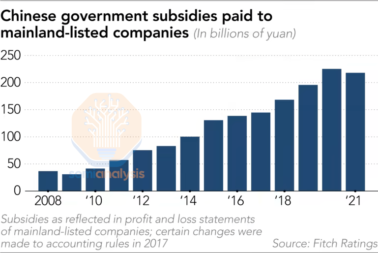

Source: [Nikkei Asia](https://asia.nikkei.com/Business/Business-Spotlight/Made-in-China-2025-thrives-with-subsidies-for-tech-EV-makers)

The Chinese manufacturing base is currently dominated by automotive and electronics production, as [China](https://sccei.fsi.stanford.edu/china-briefs/rise-robots-china) has been producing more cars than the US and Japan combined since 2009, and assembles some 70% of the world’s electronics. Even with a massive sector ripe for automation, 51% of global robot installations in 2023 were coming from China, adding 276,000 units that year alone! China’s industrial economy is one of the most formidable players in the world, setting it up perfectly to reap the next evolutions of robotics and automation.

The Made in 2025 plan was the largest catalyst toward becoming the industrial and high-tech manufacturing giant it is today. Signed by Li Keqiang in 2015, the plan initiated the move from 40% of domestic content of core components in 2020 to 70% by 2025. Additionally, the plan highlights the following six of the ten priority sectors going forward: automated machine tools & robotics, new-energy vehicles and equipment, power equipment, modern rail transport equipment, new advanced information technology, and new materials. With a focus on the entire manufacturing chain and the development of both advanced and traditional industries, the country laid out the road map to become an economic juggernaut.

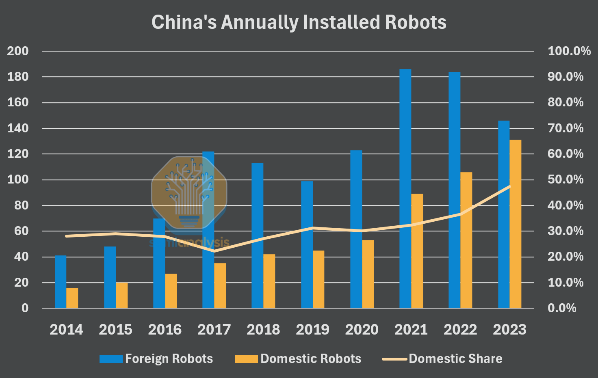

Source: SemiAnalysis, IFR.org

In 2023 they doubled down on robotics, with China’s Ministry of Industry and Information Technology posted their [four-year plan](https://www.scmp.com/news/china/politics/article/3240259/china-says-humanoid-robots-are-new-engine-growth-pushes-mass-production-2025-and-world-leadership) positioning humanoids as a strategic engine of economic growth. Within this outline, they highlighted having a robust innovation system for humanoids and to achieve “production at scale” by 2025, with the engine of growth coming online by 2027. This state-backed interest is significant for the sector as the US-China Economic and Security Review Commission posted an [Issue Alert](https://www.uscc.gov/sites/default/files/2024-10/Humanoid_Robots.pdf) in October 2024 stating that Chinese humanoid companies raised USD$769M in 2023 alone, and over USD$990M in the first half of 2024. China believes in robotics and its related form factors as the future of the country, just recently, Unitree CEO Wang Xingxing was even seen at the [private sector symposium](https://www.scmp.com/tech/big-tech/article/3299435/meet-wang-xingxing-young-chinese-robotics-star-unitree-xi-jinpings-symposium) seated across from Xi Jinping.

Even humanoids are now booming in China, still considered the most difficult form factor to unlock, with many older estimates misinterpreting the coming revolution, i.e. Goldman Sachs having to [revise](https://www.goldmansachs.com/insights/articles/the-global-market-for-robots-could-reach-38-billion-by-2035) their 2035 TAM by 6x! At the 2024 World Robot Conference in Beijing, over [27 different humanoids](https://archive.is/5StXj) were debuted and active, while the Tesla Optimus remained motionless in a clear box. A stark contrast to the Unitree H1 which was performing [synchronized choreography](https://www.youtube.com/watch?v=hrjxmJWo3IY) with both H1’s and humans nearby in Feb 2025. While it is impressive to see how well Chinese humanoids are performing, it’s more impressive that they can produce these at a much faster and larger scale than any other country. [UBTech](https://www.tweaktown.com/news/103128/chinas-humanoid-robots-slated-for-mass-production-by-end-of-2025/index.html) is already set to mass produce nearly 1000 units by late 2025. Agibot was created in 2023, and has started mass production already, with [962 units](https://www.yahoo.com/tech/former-huawei-genius-youth-recruit-093000908.html) fully produced as of December 15. Most importantly, Unitree G1 is already in the United States and [commercially available](https://toborlife.ai/g1/), and the humanoid boasts a shocking price tag of only USD$16K. There are no other humanoids in the world available for purchase by consumers, and the price tags for most humanoids are angling to be in the ~USD$100K range, and up to ~USD$200K for a significant portion.

**Subscribe to get notified of all SemiAnalysis articles**

Please verify your email address to proceed.

By subscribing, you agree to the [Privacy Policy](https://semianalysis.com/privacy-policy/) and [Terms and Conditions](https://semianalysis.com/terms-of-service/).

## What Stands to Come

This is a Call for Action. In America there are many companies attempting to build their own hardware, but in-house hardware development means the company designing and assembling it in-house, and everyone closes their eyes when the materials and base components roll in from China. The US once had a solid base to spin up heavy industry factories, but this withered away as cheaper overseas manufacturing cut US producers out and the American economy shifted toward leading edge technology and services. However, with each dilapidated factory and every “Made in China” sticker the dots connected a pointillist image of a nation depleted. Now the country stands at the bifurcated path between limitless labor expansion or obsolescence, and the echoes of industry’s past are shouting.

China knew 10 years ago that these robots would be a force and doubled down again in 2023. This is not a question of ifs: China knows what comes next if they are first to unlock these robots, they will iterate faster than the US, they will subsidize the industry to an unprecedented extent, they will achieve massive economies of scale and oversupply all global markets, and the general purpose robotics boom will be nothing but a bad dream for the US if nothing changes. The US must take part in the robotics revolution before all labor is handed over to China to own in perpetuity.

Unitree exemplifies the threat posed by China’s rise to Western industrial semiconductor suppliers. Behind paywall, we dive into the different types of electronic components found in robots, explain how western incumbents like NXP, Infineon or TXN are positioned, and highlight the Chinese threat. We also discuss leading edge logic for next-gen robots and Nvidia’s position.

Check out our friends at Edge of Automation’s Parts [1](https://www.edgeofautomation.com/p/the-physical-ai-revolution-part-1) and [2](https://www.edgeofautomation.com/p/the-physical-ai-revolution-part-ii) of the coming physical AI revolution for a great breakdown series on the current state of robotics!