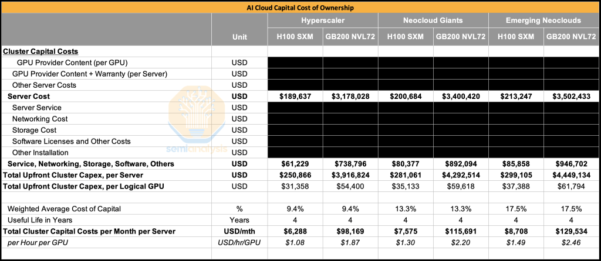
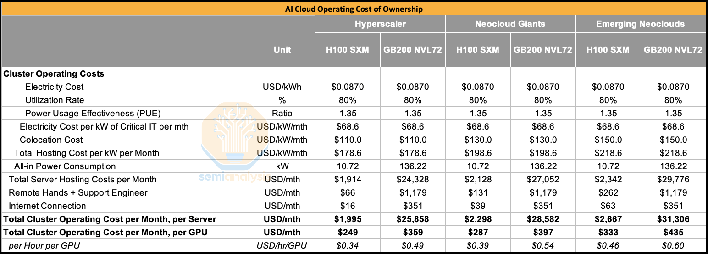
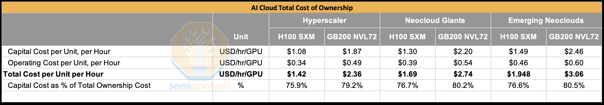
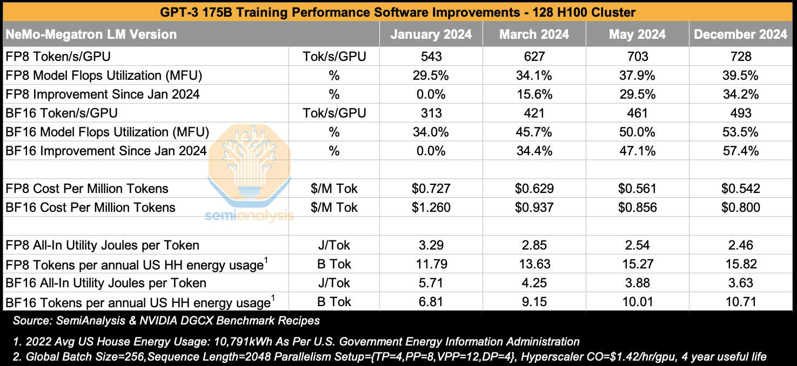
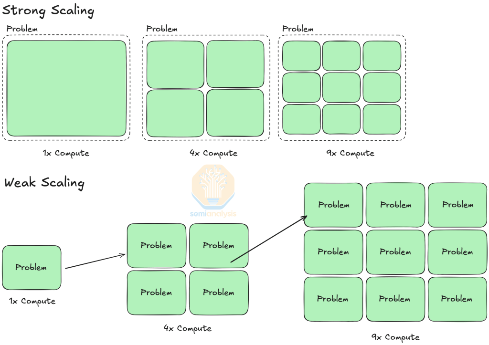
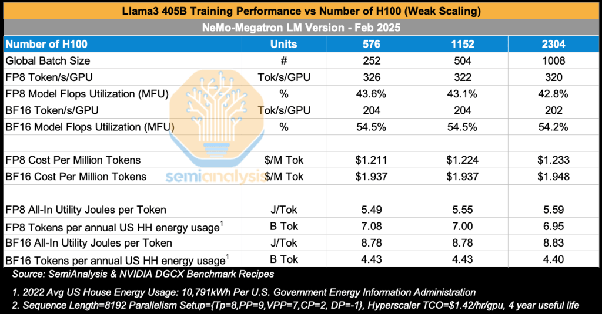
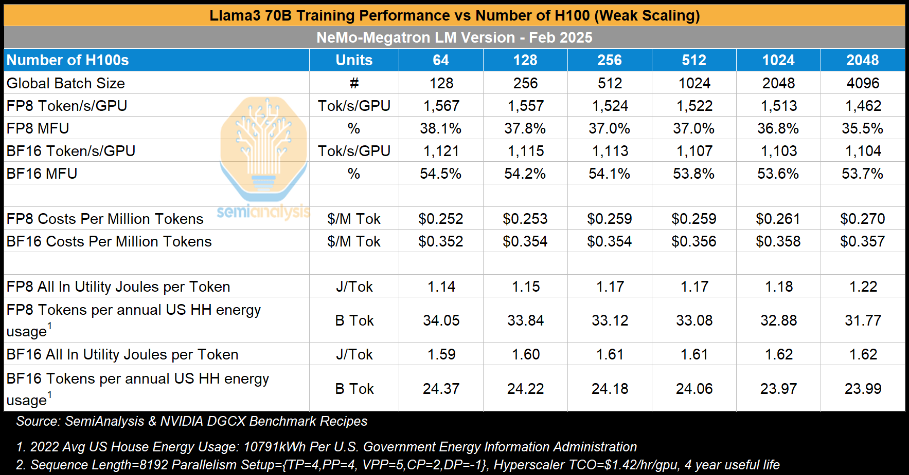
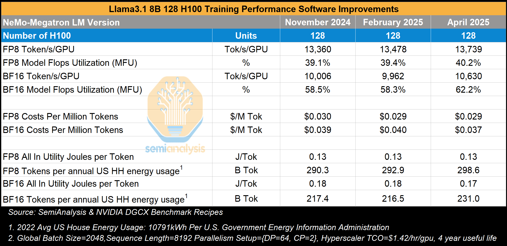

Frontier model training has pushed GPUs and AI systems to their absolute limits,
making cost, efficiency, power, performance per TCO, and reliability central to
the discussion on effective training. The Hopper vs Blackwell comparisons are
not as simple as Nvidia would have you believe.

In this report, we will start by present the results of benchmark runs across
over 2,000 H100 GPUs, analyzing data on model flops utilization (MFU), total
cost of ownership (TCO) and cost per training 1M tokens. We will also discuss
energy use, examining the energy in utility Joules consumed for each token
trained and compare it to the average US household annual energy usage,
reframing power efficiency in societal context. We will also show the results of
this analysis when scaling the GPU cluster from 128 H100s to 2048 H100s and
across different versions of Nvidia software.

Later in this report, we will also analyze GB200 NVL72 benchmark results across
Llama4 400B MoE and DeepSeek 670B MoE and compare this data to our earlier
results from the H100. We will discuss whether the GB200 NVL72 performance per $
advantages survives once reliability issues are factored in.

Downtime from poor reliability and lost engineering time is one of the main
factors that we will capture in our perf per TCO calculations. Currently there
are no large-scale training runs done yet on GB200 NVL72 as software continues
to mature and reliability challenges are worked through. This means that
Nvidia’s H100 and H200 as well as Google TPUs remain the only GPUs that are
today being successfully used to complete frontier-scale training. As it stands
today, even the most advanced operators at frontier labs and CSPs are not yet
able to carry out mega training runs on the GB200 NVL72.

With that said, every new architecture naturally requires time for the ecosystem
to ramp software to effectively utilize the architecture. The GB200 NVL72 ramp
is slightly slower than prior generations, but not by much, and we are confident
that before the end of the year, GB200 NVL72 software would have improved
considerably. Combined with frontier models architecture being codesigned with
the larger scale up world size in mind, we expect that there will be significant
efficiency gains from using the GB200 NVL72 by the end of the year.

On the reliability front, there will continue to be significant challenges that
Nvidia must work even closer with its partners to rapidly solve, but we think
the ecosystem will quickly rally its resources towards tackling these
reliability challenges.

## SemiAnalysis Is Hiring

We are looking for a new grad engineer to join our engineering team. This is an
unique opportunity to work on an high-visibility special projects with support
from many industry leaders and CEOs. If you’re passionate about performance
engineering, system reliability, and want to work at the intersection of
hardware and software, this is a rare chance to make industry wide impact.  

What you’ll work on:

- Building and running large-scale benchmarks across multiple vendors (AMD, NVIDIA, TPU, Trainium, etc.
- Designing reproducible CI/CD pipelines to automate benchmarking workflows
- Ensuring reliability and scalability of systems used by industry partners

What we’re looking for:

- Strong skills in Python
- Background in Site Reliability Engineering (SRE) or systems-level problem solving
- Experience with CI/CD pipelines and modern DevOps practices
- Curiosity about GPUs, TPUs, Trainium, multicloud, and performance benchmarking

Link to apply:
<https://app.dover.com/apply/SemiAnalysis/2a9c8da5-6d59-4ac8-8302-3877345dbce1>

## Benchmarking and Analysis Methodology

For our benchmarking and analysis, we rely on Nvidia’s DGXC Benchmarking Team’s
new DGX Cloud Benchmarking Scripts executed on NVIDIA’s internal H100 EOS
cluster, configured with 8×400 Gbit/s InfiniBand networking. These results serve
as the official reference numbers against which Neocloud environments can be
compared when defining service-level agreements (SLAs) between Neoclouds and
their customers.

Clouds can also submit benchmarks to NVIDIA and if they are able to meet these
EOS reference numbers then they can earn the NVIDIA Exemplar Cloud designation.
Our upcoming ClusterMAXv2 will heavily weight providers’ Exemplar Clouds status
when evaluating service quality as this status is a stamp of approval that a
provider can deliver reference performance numbers across many workloads for
large scale GPU deployments.

The aforementioned benchmarks are conducted using NeMo Megatron-LM, but given
that many end users of GPUs do not exclusively rely on NeMo Megatron-LM, the
DGXC benchmarking team has plans to extend coverage to native Torch DTensor
frameworks such as TorchTitan.

We would like to thank the Nvidia DGCX benchmarking team for creating these sets
of benchmarks and providing reference numbers to help lift up the GPU Cloud
industry!

## H100 and GB200 NVL72 Capex, Opex, Total Cost of Ownership Analysis

The price of an H100 server has dropped somewhat in the past 18 months to around
$190k per server. Including storage, networking and other items, the total
upfront capital cost per server comes up to $250k for a typical hyperscaler.

Turning to the GB200 NVL72, the rack scale server alone costs $3.1M for a
typical hyperscaler. Including networking, storage and other items, all in cost
comes up to about $3.9M per rack.

When comparing across all three buyer types, from Hyperscalers to Neocloud
Giants to Emerging Neoclouds, the GB200 NVL72’s all-in capital cost per GPU
comes to about 1.6x to 1.7x the all-in capital cost per GPU of the H100.

[Source: SemiAnalysis](https://semianalysis.com/ai-cloud-tco-model/)

Comparing the two systems’ operating cost of ownership, we find that the Opex
per GPU for the GB200 NVL72 is not that much higher than that of the H100. The
cost difference comes from the fact the GB200 NVL72 has a higher all-in power
consumption per GPU than the H100. This is primarily driven by the fact that the
GB200 chip consumes 1200W per chip vs 700W for the H100.

[Source: SemiAnalysis](https://semianalysis.com/ai-cloud-tco-model/)

When factoring in both capex and opex in order to arrive at the total cost of
ownership (TCO), we see that TCO for the GB200 NVL72 is about 1.6x higher than
TCO for the H100. This means that the GB200 NVL72 needs to be at least 1.6x
faster than the H100 in order to have an performance per TCO advantage when
compared to the H100.

[Source: SemiAnalysis](https://semianalysis.com/ai-cloud-tco-model/)

Before we deep dive into the benchmarks and results, we will present three key
suggestions to Nvidia.

First, we recommend that Nvidia expand their benchmarking efforts and increase
transparency even more. In order for Nvidia to continuously raise the bar across
the entire GPU cloud industry, it needs to benchmark across both its Hyperscaler
partners and Nvidia Cloud Partners (NCPs) and make the data publicly available.
With this, anyone in the ML community can factor the benchmarking data into
their decision making process before signing contracts worth tens or hundreds of
millions of dollars.

As an example, [in the first release of our ClusterMAX rating system, we pointed
out that GCP’s older a3-mega H100 delivered 10% worse than average MFU for
O(Llama 70B) size training and 15-20% worse than average for MFU of O(8x7B)
mixture of experts spare
models](https://semianalysis.com/2025/03/26/the-gpu-cloud-clustermax-rating-system-how-to-rent-gpus/#google-cloud).
Thus, end users should be paying 10-20% lower than average rental cost to GCP in
order to achieve the same performance per dollar as the market average. Having a
publicly available set of benchmark results across the Hyperscaler and NCP
providers will dramatically increase the ease of negotiating fair contract
prices and speed up decision making. This can save considerable time and money
on both sides by obviating the need for extensive, costly and time-consuming
proof of concept runs.

Our second recommendation to Nvidia is that they expand their benchmarking focus
beyond NeMo-MegatronLM as many users prefer to use Native PyTorch with FSDP2 and
DTensor instead of NeMo-MegatronLM. One advantage of using NeMo-MegatronLM is
that at any given time, there are many performance features in NeMo-MegatronLM
that aren’t yet available in native PyTorch. It is reasonable for the latest
features to be rolled out to NeMo-Megatron first, but all of these features
should be upstreamed to native PyTorch after a month’s time at most. To this
end, more Nvidia engineers should be allocated towards PyTorch core development
instead of being tasked with adding more features to NeMo. Nvidia expanding
benchmarking focus should include runs employing PyTorch will dovetail perfectly
with this initiative as well.

Instead of having engineers optimize NeMo, they should be optimizing TorchTitan.
The new [NeMo AutoModel](https://github.com/NVIDIA-NeMo/Automodel/) library is a
step in the right direction it as supports native PyTorch FSDP2 backend in
addition to Megatron-LM, noticeability missing is native PyTorch 3D+ Parallelism
with DTensor and a lot of pretraining features is absent and most of the
features is for finetuning.

Our third recommendation is that Nvidia continue to accelerate development of
diagnostics and debugging tools for GB200 NVL72 backplane. Unfortunately, even
after an extensive burn-in process, the NVLink copper backplane still is not
that reliable. Operators of the GB200 NVL72 also lament that this problem is
compounded by the fact that the tools used to diagnose and debug back-plane
related errors are behind and sub-optimal. Nvidia can also improve the situation
by insisting on even stricter acceptance tests across their ODM/OEM partners
before handing GB200 NVL72 racks over to their customers.

## GPT-3 175B Token/s/GPU, Training Performance and Power. Cost Improvements from January 2024 to December 2024

In the table below, we present the results of our benchmark runs in which we
train GPT-3 175B on a 128 H100 cluster at different points in time. We chose to
display results across different NeMo-Megatron LM Versions starting from January
2024 and ending in December 2024, representing one year and two years
respectively from the start of H100 mass deployment.

The benchmark setup uses 128 H100s with 4 data replicas. Each data replica
consists of 32 GPUs parallelized with each layer tensor parallelized using the
NVLink domain across 4 GPUs (i.e. TP=4) and then pipelined. One might think that
it would be best to do TP=8 to match the entire NVLink domain world size of 8
GPUs for the H100, but for GPT-3 175B model, it is better to use TP=4 as this
will have a higher arithmetic intensity.

To elaborate, GPT3 175B’s hidden dimension is 12,288, which means if one were to
use TP=8, the result will be a small K reduction dim of 1,536. By comparison,
when using TP=4, the hidden reduction dim will instead be 3,072.

The sequence length of the benchmark follows the [original GPT-3 paper
setup](https://arxiv.org/pdf/2005.14165) and uses 2,048 seq length as well as a
global batch size of 256 samples. This means the model will see 500k (Global
Batch Size \* Seq Len) tokens before each optimizer step.

When looking at BF16 model flops utilization (MFU), we see a considerable
improvement from 34% MFU to 54% MFU over the course of 12 months, amounting to a
57% improvement in training throughput solely from software improvements across
the CUDA stack. This improvement results from NVIDIA CuDNN/CuBLAS engineers
writing more optimized fused wgmma kernels, NCCL engineers writing more
optimized collectives that use fewer SMs for communication among other
improvements. At the end of the day, it is the full software stack optimization
that matters.

We see the same trend for FP8 MFU, improving from 29.5% MFU to 39.5% MFU in that
same time, for a 34% improvement in throughput from just software gains alone.

Turning to costs, assuming a cost of $1.42/hr/GPU excluding any rental margin,
we see that the cost to train GPT-3 175B on FP8 went from 72 cents per 1M tokens
trained in Jan 2024 to just 54.2 cents per million tokens by Dec 2024. That
means that the cost to train GPT-3 175B when using the [original training token
count of 300B](https://arxiv.org/pdf/2005.14165) improved from $218k in Jan 2024
to only $162k by Dec 2024.

Finally, we examine the power consumption from training GPT-3. We estimate the
all in power draw for the 128 H100 cluster inclusive of GPUs, CPUs, networking,
storage and other components. We then gross this up by the power usage
effectiveness (PUE) of a typical colocation data center to arrive the all-in
utility Joules per token.

As an unwelcome flashback to high school physics, a Joule is a unit of energy
that is equivalent the work done when a force of 1 Newton moves an object 1
meter in the direction of the force. Lighting an incandescent 60W light bulb for
one second consumes 60 Joules (a Watt (W) is a unit of energy consumption per
second) and consumes 216kJ per hour. An alternative way to express units of
energy is to use watt-hours or kilowatt-hours, which is just the power of a
device multiplied by the number of hours which it is utilized over. The average
annual US household in 2022 consumed 10,791kWh of energy or approximately
38,847,600,000 Joules. Dividing this 10,791 kWh by 8,760 hours per year gives us
1,232 W of power on average over the year – a little more than the 1,200W used
by a single GB200 GPU!

We see that each token trained consumes 2.46 Joules for FP8 and 3.63 Joules for
BF16 when using the December 2024 version of NVIDIA software. If we had an
energy budget equivalent to the average US household’s annual energy
consumption, we could train 15.8B FP8 tokens. Extending this calculation
further, training 300B tokens on GPT3 175B would require 19 annual US
households’ worth of energy consumption for FP8 and 28 households’ worth of
annual energy consumption for BF16.

GPT-3’s total training cost of $162k and 19 households’ annual energy
consumption doesn’t sound excessive, but it is the many experiments and many
failed training runs that add up to the ballooning energy growth from AI
Training we are seeing now in the United States.

## Weak vs Strong Scaling

Strong and weak scaling describe the performance improvement of scaling compute
resources for different problem setups, for instance, different batch sizes.

Strong scaling refers to scaling compute resources while keeping the model size
and global batch size the same. In such a case, Amdahl’s Law, which describes
the speedup that can be achieved by parallelizing computing steps, can be used
to quantify the speedup of strong scaling.

On the other hand, weak scaling refers to scaling compute resources to solve
larger problems at a constant time. AI Training inherently utilizes weak scaling
since you can scale up your model size and your global batch size (depending on
convergence) by scaling up the number of GPUs used a training job.

Source: SemiAnalysis, [Performance and Scalability – SCENET Summer School](https://acenet-arc.github.io/ACENET_Summer_School_General/05-performance/index.html)

## Llama3 405B Token/s/GPU, Cost Per Million Tokens, Joules Per Token vs Number of GPUs (Weak Scaling)

In this benchmark, we examine how training performance for Llama3 405B varies as
we increase the number of H100 GPUs in the cluster – an example of weak scaling.

In the table below, we see how as we increase the GPU cluster size from 576
H100s to 2,304 H100s, both FP8 MFU and BF16 MFU hover around 43% MFU and 54% MFU
respectively across all sizes. In the training run published in the [Llama 3
Herd of Models Paper](https://arxiv.org/pdf/2407.21783), researchers used 16k
H100s to train Llama 3 405B, [achieving a BF16 MFU of
41%](https://arxiv.org/pdf/2407.21783) for pretraining using a similar
parallelism strategy. Note that the above pre-training runs used a sequence
length of 8192, whereas for mid-training context extension, each sample’s
sequence length is 131,072 instead of 8,192. This longer sequence length
requires context parallelism across 16 nodes resulting in MFU dropping to 38%
due to the additional communication needed for ring attention.

Source: SemiAnalysis

Turning to total cost of training, we see that carrying out just the
pre-training run, training Llama 3 405B over 15T tokens, costs $1.95 per million
tokens when training using BF16 using a 2,304 H100 cluster. This adds up to
$29.1M just for the pretraining phase, which is dramatically higher than mixture
of expert models such as DeepSeek – which cost only $5M per training run.

Of course, we stress once more that this cost reflects the cost for a single
final successful training run and the cost of the many experiments needed to get
to that final stage as well as the cost of employing researchers, among other
costs.

Since Llama3 405B is approximately 2.3x larger than GPT3 175B in terms of total
parameter count, the all-in utility Joules per token is about 2.3x greater for
Llama 3 405B vs GPT3 175B at 8.8 Joules per token vs 3.6 Joules per token
respectively.

This means that for the same energy as the average US household consumes in a
year, Meta can train 4.4B tokens on Llama3 405B on BF16. To train to convergence
using 15T tokens, Meta would require an amount of energy equal to the annual
consumption of an entire neighborhood of 3,400 US households.

## Llama3 70B Training Performance Token/s/GPU, Cost Per Million Tokens, Joules Per Token vs Number of GPUs (Weak Scaling)

Next, we look at Llama3 70B training performance for different cluster sizes. As
we increase the cluster size from 64 H100s to 2,048 H100s, we see that
performance for FP8 drops by 10%, dropping from 38.1% for 64 GPUs down to 35.5%
for 2,048 GPUs. It is quite interesting that the MFU drops by so much (on a
percentage basis – which is what really matters given the low MFU base) because
the per data replica batch size doesn’t change as we scale up and the
parallelism also strategy doesn’t change. All runs still continue to use
TP=4,PP=2, and context parallel=2 – the only real change is adding more data
replicas. Interestingly, for BF16, the drop in MFU is far smaller at only 1-2%,
dropping from 54.5% MFU for 64 H100s down to 53.7% for 2,408 GPUs.

Llama3 405B is 5.7x larger than Llama3 70B, and as with any dense models, the
number of FLOPs required is linear with respect to the number of parameters. As
such, the cost to train Llama 3 405B should be 5.7x greater than that of Llama 3
70B. In practice, at the ~2k H100 scale, Llama3 405B is 5.4x more expensive in
terms of the cost per million tokens using BF16.

In terms of power consumption, we see that for FP8, training consumes 10% more
energy per token when training on 2,408 H100s vs 64 H100s. To train Llama 3 70B
to convergence with 15T tokens on FP8 using at 64 H100s would only use energy
equal to 440 US households’ annual energy consumption, whereas at the 2,048 H100
scale, we would require energy equivalent to 472 US households’ annual energy
consumption.

## Llama3 8B Training Performance Over Time

Larger models like Llama3 405B and Llama3 70B both use tensor parallelism,
pipeline parallelism and data parallelism, but training Llama3 8B only requires
context parallelism across the 8,192 sequence length for each pair of GPUs
within the NVLink domain and uses data parallelism to spread the work beyond
across other pairs of GPUs. In this analysis – we also look at training
performance with respect to time in order to gauge how software improvements
across the stack have affected training performance. We see that performance has
only improved slightly from November 2024 to April 2025, the latter date being a
full 23 months after Hopper began mass deployment.

In the next section, we deep dive into the current state of GB200 NVL72 training
performance as compared to training on the H100. We will discuss benchmarks from
training DeepSeek 670B MoE and Llama4 400B MoE, analyzing GB200’s performance
per total cost of ownership (TCO) vs that of the H100.

We will also zoom into the aforementioned lack of effective GB200 NVL72
diagnostic and debugging tools and discuss the many issues contributing to the
unreliability of GB200 NVL72. These are the challenges that NVIDIA, CSPs,
Neoclouds and the end users at frontier labs must solve in order to successfully
and cost effectively train frontier models on the GB200 NVL72 before the end of
the year.

##### Subscribe for full access to this article

With a SemiAnalysis subscription you’ll get access to newsletter articles and
article discussions.

Model access not included – please reach out to
[sales@semianalysis.com](mailto:sales@semianalysis.com) for our institutional
offerings.

Please verify your email address to proceed.

By subscribing, you agree to the [Privacy
Policy](https://semianalysis.com/privacy-policy/) and [Terms and
Conditions](https://semianalysis.com/terms-of-service/).