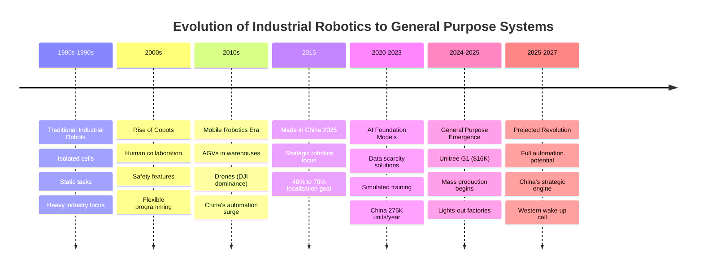

# Robotics Evolution Timeline

## Context
The article traces the evolution of robotics from rigid industrial robots to the emerging general-purpose systems. This timeline captures the key milestones and shifts in the industry, showing how robotics has progressed from isolated, task-specific machines to collaborative and eventually autonomous systems.

## Key Insights
- The progression shows an acceleration in recent years, particularly after 2015 with China's strategic initiatives
- The cost reduction from ~$100K-200K humanoids to Unitree's $16K G1 represents a massive leap in accessibility
- The timeline reveals how China positioned itself during the 2010s to capture the 2020s robotics boom