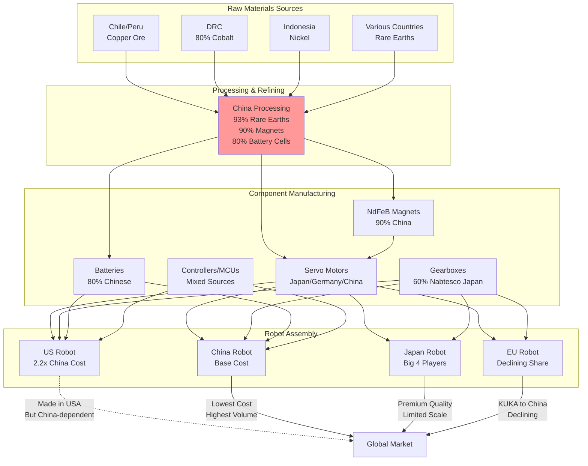

# Global Robotics Supply Chain Dependencies

## Context
The article reveals alarming dependencies on China for critical robotics components. Even products labeled "Made in USA" rely heavily on Chinese materials and processing. This flowchart maps the complex supply chain showing how raw materials flow through processing to final robot assembly.

## Key Insights
- China controls critical processing nodes, creating bottlenecks even for "Made in USA" products
- The 2.2x cost differential between US and Chinese robot manufacturing stems from supply chain control
- Western dependency extends beyond final assembly to fundamental materials processing