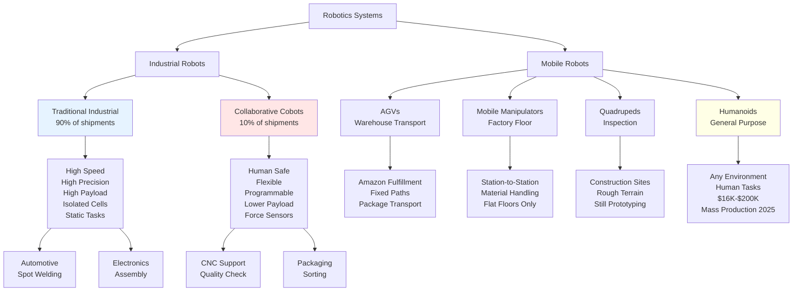

# Robot Types and Applications Hierarchy

## Context
The article categorizes robots into industrial and mobile categories, each with distinct characteristics, applications, and trade-offs. This hierarchy shows the progression from rigid industrial robots to flexible humanoids, highlighting the evolution toward general-purpose systems.

## Key Insights
- Traditional industrial robots still dominate at 90% of shipments but are limited to structured environments
- Cobots represent the bridge between rigid automation and flexible systems, growing at 10% share
- Humanoids promise general-purpose capability but face the challenge of reducing costs from $100-200K to competitive levels (Unitree achieved $16K)