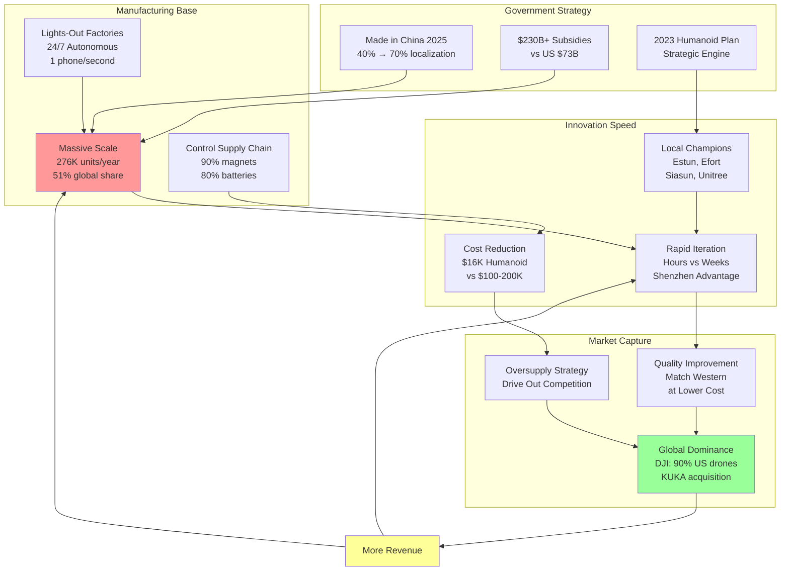

# China's Strategic Robotics Dominance Cycle

## Context
The article describes how China has created a self-reinforcing cycle of robotics dominance through strategic investments, manufacturing scale, and rapid iteration. This diagram illustrates the flywheel effect that makes it increasingly difficult for competitors to catch up.

## Key Insights
- China's strategy creates a self-reinforcing cycle where success breeds more success
- The combination of government support ($230B vs US $73B) and manufacturing scale creates insurmountable advantages
- The DJI drone example (90% US market share) shows how this playbook works in robotics-adjacent markets