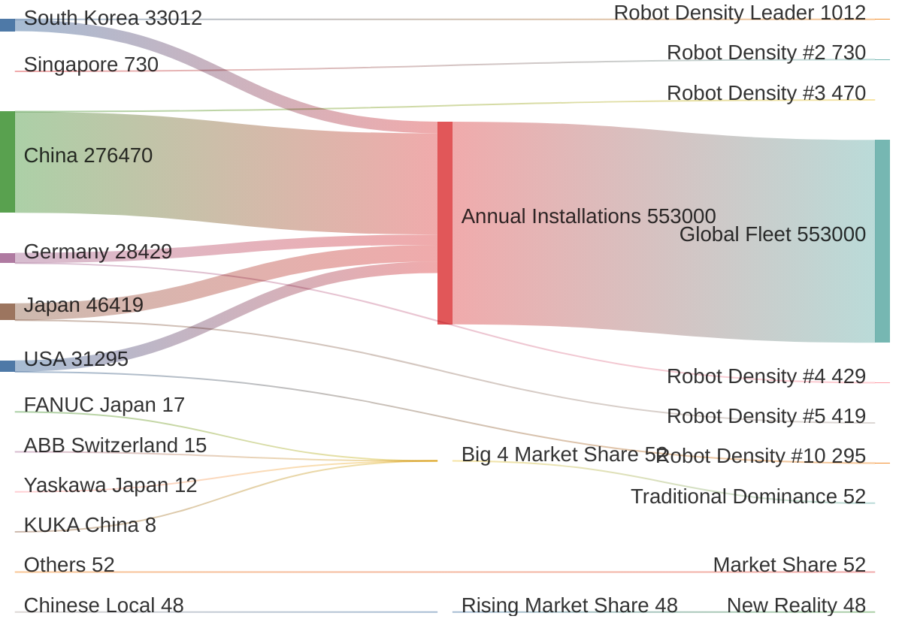

# Global Robotics Market Competition Landscape

## Context
The article presents data on robot density, market shares, and the shifting competitive landscape. China has moved from outside the top 10 in 2018 to 3rd place globally in robot density by 2024, while installing more robots annually than all Western incumbents combined.

## Key Statistics from Article
- **Robot Density (robots per 10,000 employees):**
  - South Korea: 1,012 (10% workforce automated)
  - China: 470 (overtook Germany in 2024)
  - USA: 295 (49% lower than wage-adjusted expectation)

- **Annual Installations (2023):**
  - China: 276,000 units (51% of global)
  - Combined West: ~135,000 units
  
- **Market Evolution:**
  - Chinese local firms: 50% domestic share (up from 30% in 2020)
  - Big 4 increasingly dependent on China market
  - Western installations peaked 2016-2018, still below those levels