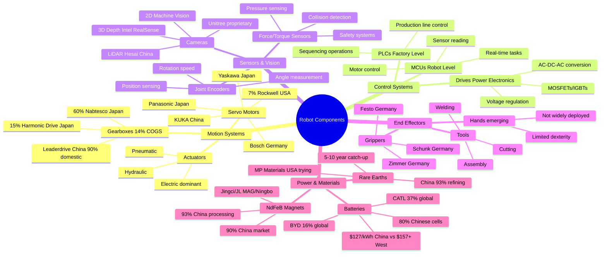

# Robot Hardware Components and Supply Sources

## Context
The article provides detailed breakdown of robot components, their functions, and global supply concentration. This diagram maps the critical components, their suppliers, and the concerning concentration of supply sources.

## Key Insights
- Gearboxes represent the highest COGS at 14%, with Japan's Nabtesco controlling 60% of the market
- China controls critical materials: 90% of permanent magnets, 80% of batteries, 93% of rare earth processing
- US presence is minimal: only 7% in servo motors (Rockwell), attempting to build rare earth capacity