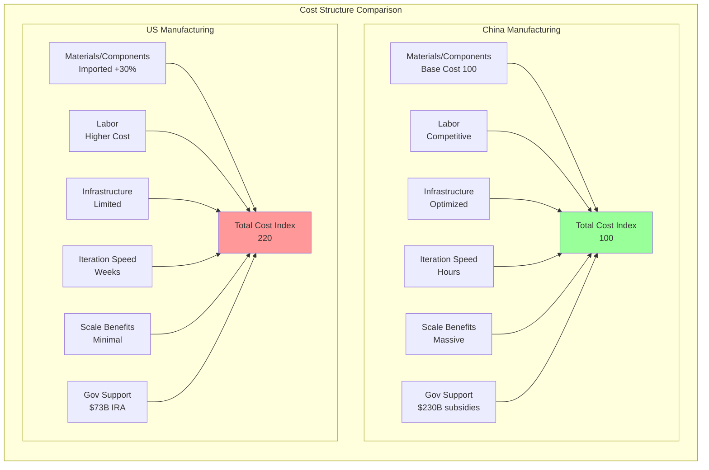
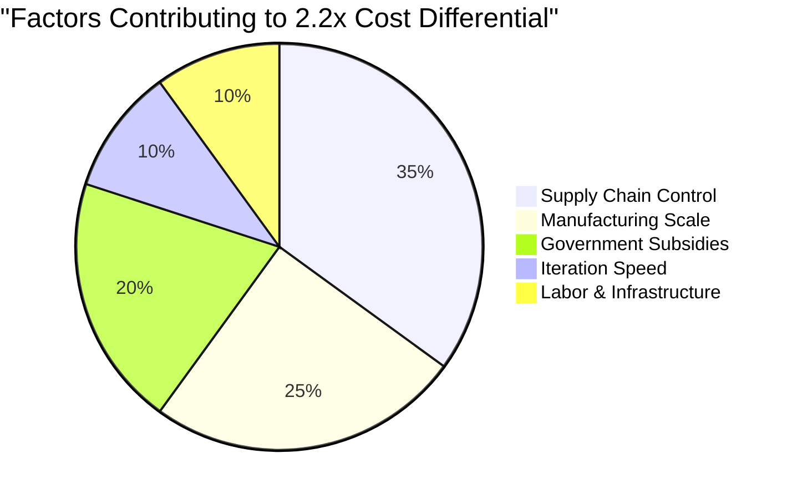

# Manufacturing Cost Comparison: US vs China

## Context
The article reveals that building an identical robot arm (modeled after UR5e) in the US is approximately 2.2x more expensive than in China. This cost structure analysis shows where the disadvantages compound.

## Detailed Cost Drivers

## Real-World Examples
- **Battery Costs:** China $127/kWh vs North America $157/kWh (24% higher)
- **Factory Construction:** US plants cost 46% more per GWh than Chinese counterparts
- **Iteration Speed:** DJI in Shenzhen could get parts in hours; GoPro needed weeks for shipping
- **Result:** GoPro Karma drone failed against DJI despite similar pricing ($999 vs $1,099)