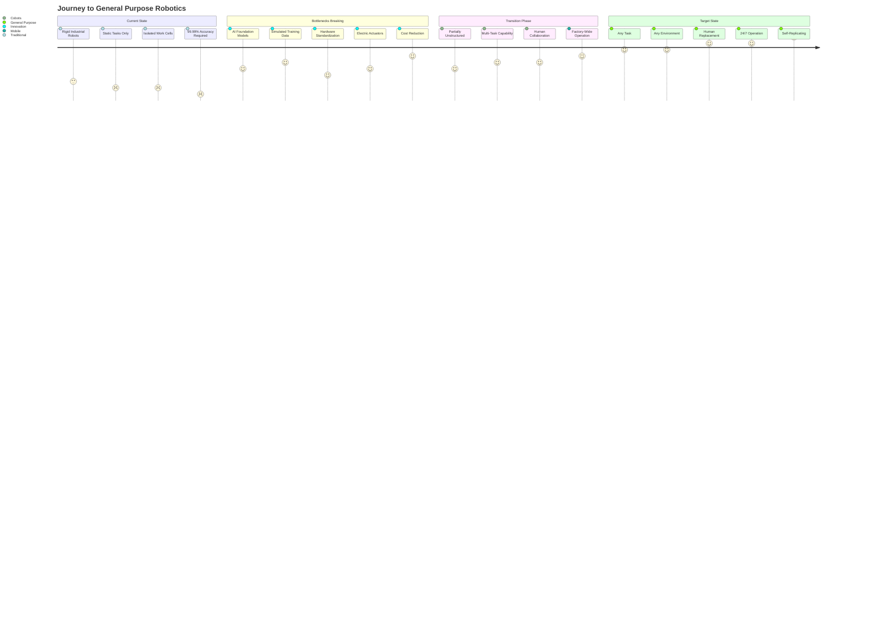
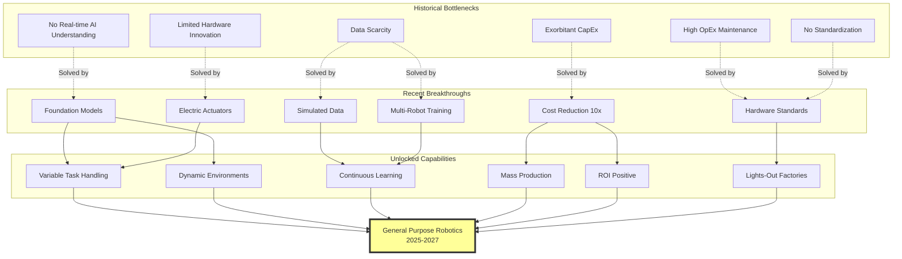

# Path to General Purpose Robotics

## Context
The article describes the evolution from rigid, task-specific robots to the holy grail of general-purpose robotics. This journey map shows the bottlenecks being overcome and the progression toward robots that can replace human labor across all domains.

## Bottlenecks and Breakthroughs

## Key Milestones
- **Google's Arm Farm (Historical):** 14 robots, 3,000 hours just for reliable grasping - never left the lab
- **China's Lights-Out Factories (Current):** Xiaomi produces 1 smartphone/second with zero humans
- **Unitree G1 (2024):** First commercially available humanoid at $16K
- **Mass Production (2025):** UBTech targeting 1,000 units, Agibot already at 962 units
- **Strategic Engine (2027):** China's target for robotics as economic growth driver