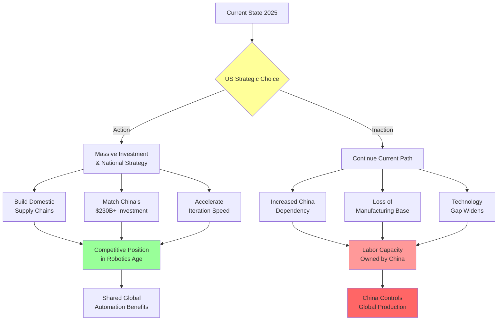
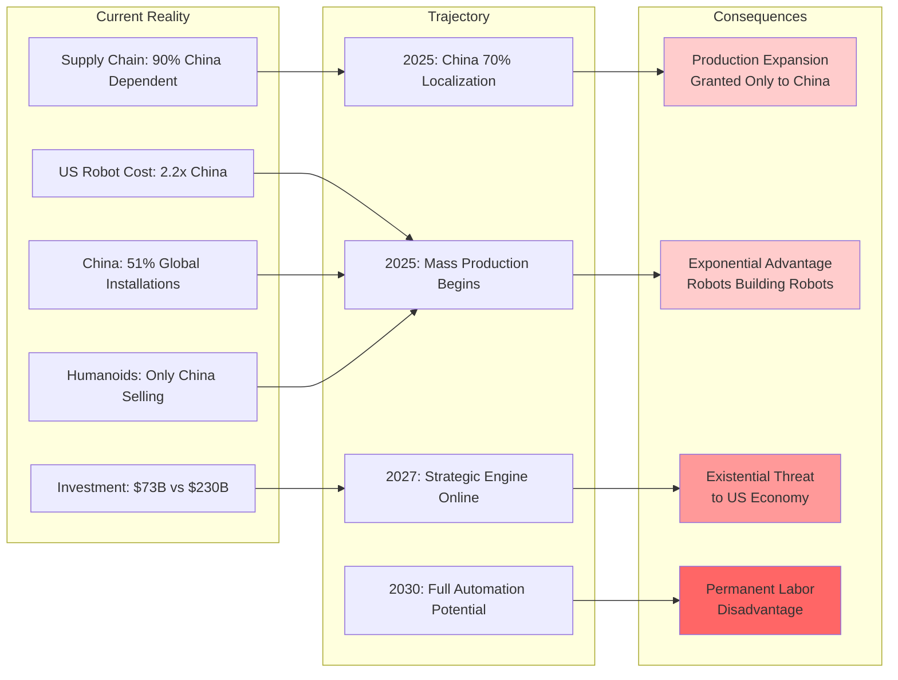
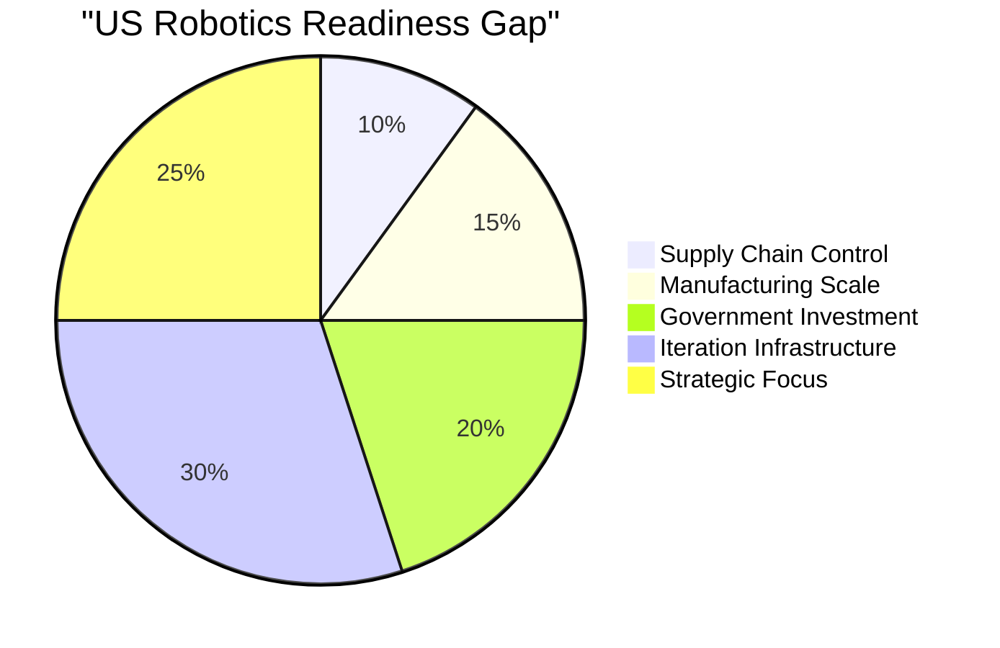

# Strategic Implications and Call to Action

## Context
The article concludes with an urgent call to action for the United States, warning that failure to participate in the robotics revolution means handing over all future labor capacity to China. This diagram maps the strategic choices and their consequences.

## Critical Warning Signs

## Action Required

## Key Quotes from Article
- "This is a Call for Action for the United States of America and the West"
- "The only country positioned to capture this level of automation is currently China"
- "Should China achieve it without the US following suit, the production expansion will be granted only to China, posing an existential threat"
- "General purpose robotics would make this indistinguishable from a living organism"
- "The US must take part in the robotics revolution before all labor is handed over to China to own in perpetuity"