# Country-Specific Robotics Strategies and Outcomes

## Context
The article analyzes how different countries approached robotics automation, their strategic decisions, and resulting market positions. This comparison reveals why China succeeded while others struggle.

```mermaid
graph TB
    subgraph "South Korea 🇰🇷"
        SK[Robot Density #1<br/>1,012/10K workers]
        SKS[Strategy: Extreme Automation<br/>10% workforce automated]
        SKC[Challenges:<br/>- Birth rate crisis<br/>- 60% imported components<br/>- Limited manufacturing]
        SKI[Investments:<br/>- Samsung $163B<br/>- Hyundai/Boston Dynamics<br/>- Gov $2.26B by 2030]
    end
    
    subgraph "Japan 🇯🇵"
        JP[Robot Density #5<br/>419/10K workers]
        JPS[Strategy: Quality Leadership<br/>Big 4: FANUC, Yaskawa]
        JPC[Challenges:<br/>- Aging population<br/>- 13% below 2018 peak<br/>- Limited innovation]
        JPI[Strengths:<br/>- 60% gearbox control<br/>- Premium components<br/>- Decades experience]
    end
    
    subgraph "Germany/EU 🇪🇺"
        DE[Robot Density #4<br/>429/10K workers]
        DES[Strategy: Industrie 4.0<br/>Industrial integration]
        DEC[Disasters:<br/>- KUKA sold to China<br/>- Multiple acquisitions<br/>- Energy crisis]
        DEI[Response:<br/>- 2025 Call to Action<br/>- Policy reforms<br/>- Too late?]
    end
    
    subgraph "USA 🇺🇸"
        US[Robot Density #10<br/>295/10K workers]
        USS[Strategy: ???<br/>No coherent plan]
        USC[Problems:<br/>- 49% below expected<br/>- Manufacturing outsourced<br/>- Policy inconsistency]
        USI[Attempts:<br/>- CHIPS Act uncertain<br/>- IRA under threat<br/>- $73B vs China $230B]
    end
    
    subgraph "China 🇨🇳"
        CN[Robot Density #3<br/>470/10K workers]
        CNS[Strategy: Total Dominance<br/>Made in China 2025]
        CNC[Advantages:<br/>- 276K units/year<br/>- Supply chain control<br/>- Lights-out factories]
        CNI[Execution:<br/>- $230B+ subsidies<br/>- 40%→70% localization<br/>- Humanoids by 2025]
    end
    
    SK --> Outcome1[Dependent on imports]
    JP --> Outcome2[Premium but limited]
    DE --> Outcome3[Lost to China]
    US --> Outcome4[Falling behind]
    CN --> Outcome5[Global domination]
    
    style Outcome1 fill:#ffcccc
    style Outcome2 fill:#ffffcc
    style Outcome3 fill:#ff9999
    style Outcome4 fill:#ff9999
    style Outcome5 fill:#99ff99
```

## Strategic Timeline Comparison

## Key Lessons
- **Timing Matters:** China started serious investment in 2015, now reaping benefits
- **Scale Wins:** China's 276K annual installations dwarf combined Western efforts
- **Policy Consistency:** China's multi-year plans vs US policy uncertainty
- **Vertical Integration:** Chinese firms achieving 95% in-house production
- **Speed of Iteration:** Shenzhen's hours vs Western weeks determines winners