# Executive Dashboard: Robotics Revolution Key Metrics

## Context
This dashboard summarizes the critical metrics and insights from the article, providing a comprehensive overview of the global robotics landscape and the urgent challenges facing the United States.

## Key Performance Indicators

```mermaid
graph LR
    subgraph "Robot Density (per 10K workers)"
        KR[🇰🇷 1,012]
        SG[🇸🇬 730]
        CN[🇨🇳 470]
        DE[🇩🇪 429]
        JP[🇯🇵 419]
        US[🇺🇸 295]
    end
    
    subgraph "Annual Growth Rate"
        CNG[🇨🇳 +44%]
        USG[🇺🇸 Stagnant]
        JPG[🇯🇵 -13% from peak]
        DEG[🇩🇪 Modest growth]
    end
    
    subgraph "Market Control"
        DJI[Drones: DJI 90% US market]
        BAT[Batteries: CATL 37% global]
        GEAR[Gearbox: Nabtesco 60%]
        MAG[Magnets: China 90%]
    end
```

## Strategic Scorecard

| Metric | China 🇨🇳 | USA 🇺🇸 | Status |
|--------|-----------|---------|--------|
| **Manufacturing Cost** | Base (1.0x) | 2.2x | 🔴 Critical |
| **Supply Chain Control** | 90% | <10% | 🔴 Critical |
| **Annual Installations** | 276,000 | 31,000 | 🔴 Critical |
| **Government Investment** | $230B+ | $73B | 🟡 Concerning |
| **Iteration Speed** | Hours | Weeks | 🔴 Critical |
| **Humanoid Production** | Active | None | 🔴 Critical |
| **Strategic Plan** | Clear 2025-2030 | Unclear | 🔴 Critical |

## The Clock Is Ticking

## Bottom Line
**"The US must take part in the robotics revolution before all labor is handed over to China to own in perpetuity."**

- **Immediate Risk:** China achieving general-purpose robotics without US participation
- **Consequence:** Permanent loss of manufacturing competitiveness
- **Required Action:** National strategy matching China's $230B+ investment
- **Timeline:** 2025-2027 is the critical window