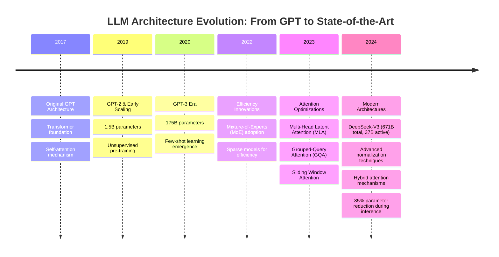

# LLM Architecture Evolution Timeline

## Context
This visualization shows the evolution of Large Language Model architectures from GPT to modern state-of-the-art implementations, highlighting key innovations and their impact on performance and efficiency.

## Visualization

## Key Insights
- Seven years post-GPT, core transformer architecture remains foundational
- Major innovations focus on computational efficiency rather than fundamental redesign
- MoE architecture enables massive scale with manageable inference costs
- Attention mechanism optimizations provide 25-75% memory savings