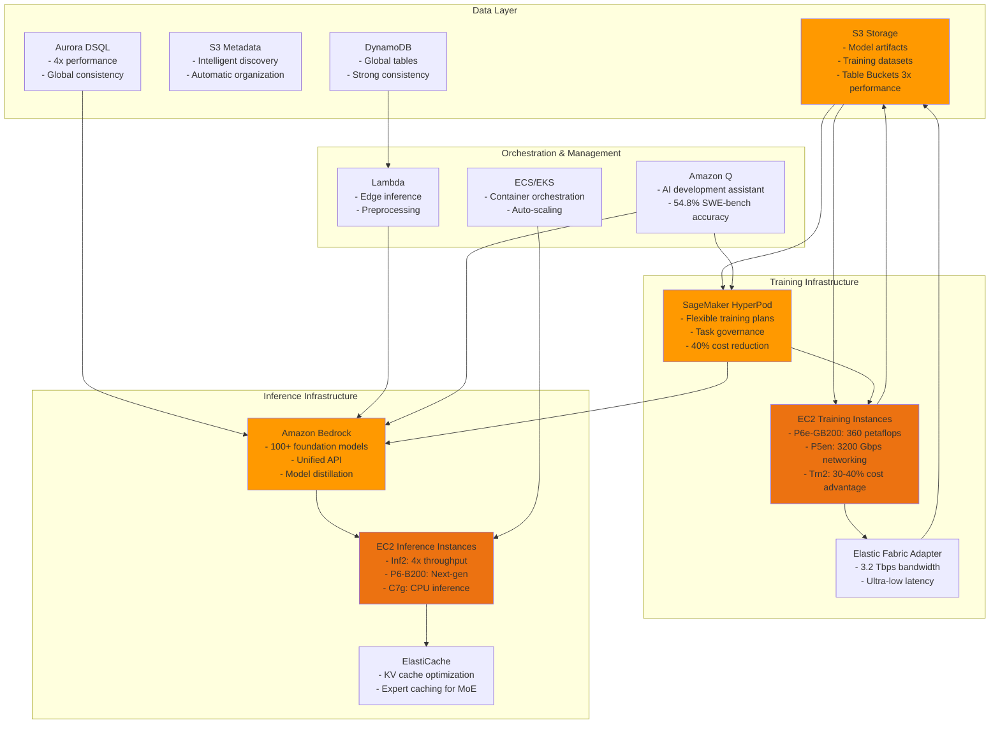

# AWS Services Architecture for LLM Pipelines

## Context
This diagram illustrates the comprehensive AWS service ecosystem for implementing modern LLM training and inference pipelines, showing the relationships between different service categories and their role in the AI/ML workflow.

## Visualization

## Key Insights
- Integrated ecosystem provides end-to-end LLM pipeline support
- Cost optimization through custom silicon (Trainium2) and intelligent resource management
- Multiple deployment options from serverless (Lambda) to high-performance clusters (P6e)
- Unified model access through Bedrock reduces integration complexity by 50%