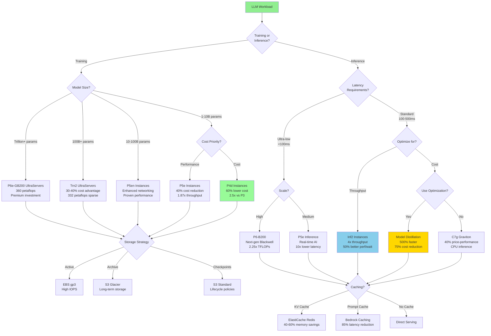

# LLM Cost Optimization Strategy Flowchart

## Context
This flowchart guides decision-making for optimizing costs across LLM training and inference workloads on AWS, incorporating architectural innovations and service-specific optimizations.

## Visualization

## Key Insights
- Model size and latency requirements drive instance selection decisions
- Cost optimization achieves 30-75% reduction through architectural choices
- Caching strategies provide additional 40-85% performance improvements
- Distillation offers the highest ROI with 500% performance gain at 75% lower cost