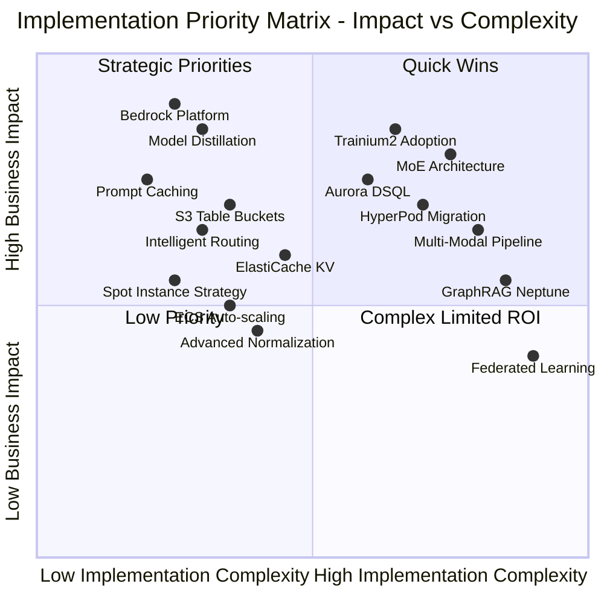

# Strategic Implementation Priority Matrix

## Context
This matrix visualization helps organizations prioritize AWS service adoption and LLM architecture implementations based on impact and implementation complexity, derived from the strategic recommendations in the report.

## Visualization

## Key Insights
- **Quick Wins (Quadrant 1):** Bedrock, Model Distillation, and Prompt Caching offer immediate 30-85% improvements
- **Strategic Priorities (Quadrant 2):** MoE Architecture and Trainium2 require investment but deliver 40-85% cost reduction
- **Balanced Approach:** Mix quick wins with strategic investments for optimal ROI
- **Timeline:** Implement Quadrant 1 immediately, Quadrant 2 within 3-6 months