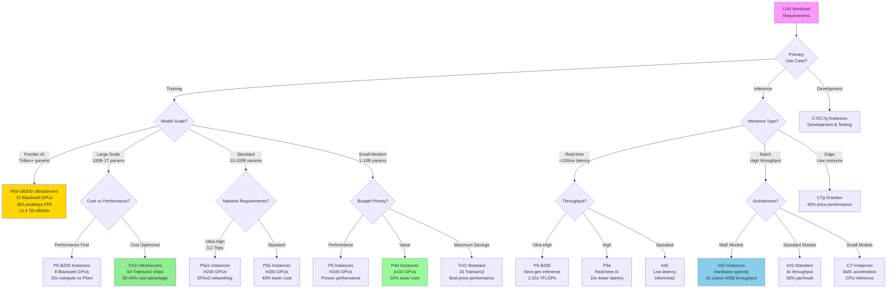

# EC2 Instance Selection Decision Tree for LLM Workloads

## Context
This decision tree helps select the optimal EC2 instance type based on specific LLM workload requirements, incorporating the latest GPU and custom silicon options from AWS.

## Visualization

## Key Insights
- Frontier models (trillion+ parameters) require P6e-GB200 with 72 GPUs
- Cost-optimized training achieves 30-40% savings with Trainium2
- Inference optimization through Inferentia2 delivers 4x throughput improvement
- Instance selection directly impacts total cost of ownership by 40-90%