# Amazon Bedrock Platform Architecture

## Context
This comprehensive diagram illustrates the Amazon Bedrock platform ecosystem, showing how it provides unified access to foundation models, enterprise features, and integration with AWS services for complete AI application development.

## Visualization

```mermaid
graph TB
    subgraph "Foundation Model Providers"
        AI21[AI21 Labs<br/>Jurassic Models]
        Anthro[Anthropic<br/>Claude Models]
        Cohere[Cohere<br/>Command Models]
        Meta[Meta<br/>Llama Family]
        Mistral[Mistral AI<br/>Multilingual Models]
        OpenAI[OpenAI<br/>GPT Models]
        Stability[Stability AI<br/>Stable Diffusion]
        Amazon[Amazon<br/>Titan Models]
        DeepSeek[DeepSeek<br/>MoE Models]
    end
    
    subgraph "Bedrock Core Platform"
        API[Unified API Layer<br/>Single interface<br/>100+ models]
        
        subgraph "Model Services"
            Inference[Model Inference<br/>Serverless deployment]
            FineTune[Fine-Tuning<br/>Visual interface<br/>LoRA optimization]
            Distill[Model Distillation<br/>500% faster<br/>75% cost reduction]
        end
        
        subgraph "Optimization Features"
            PromptCache[Prompt Caching<br/>85% latency reduction]
            Router[Intelligent Routing<br/>30% cost reduction]
            Marketplace[Bedrock Marketplace<br/>Specialized models]
        end
    end
    
    subgraph "Enterprise Features"
        subgraph "Security & Compliance"
            Compliance[SOC/ISO/HIPAA<br/>Certified deployment]
            Privacy[Data Isolation<br/>No model training]
            Encrypt[End-to-End Encryption]
        end
        
        subgraph "Knowledge & RAG"
            KB[Knowledge Bases<br/>Enterprise data]
            GraphRAG[GraphRAG Neptune<br/>Relationship mapping]
            Kendra[Kendra GenAI<br/>40+ connectors]
        end
        
        subgraph "Agents & Automation"
            Agents[Managed Agents<br/>Multi-step workflows]
            DataAuto[Data Automation<br/>Multimodal ETL]
            Guards[Guardrails<br/>Content filtering]
        end
    end
    
    subgraph "Integration Layer"
        Q[Amazon Q<br/>AI Assistant]
        SageMaker[SageMaker<br/>Training platform]
        S3[S3 Storage<br/>Data management]
        Lambda[Lambda<br/>Serverless compute]
    end
    
    AI21 --> API
    Anthro --> API
    Cohere --> API
    Meta --> API
    Mistral --> API
    OpenAI --> API
    Stability --> API
    Amazon --> API
    DeepSeek --> API
    
    API --> Inference
    API --> FineTune
    API --> Distill
    
    Inference --> PromptCache
    Inference --> Router
    Inference --> Marketplace
    
    API --> Compliance
    API --> Privacy
    API --> Encrypt
    
    API --> KB
    KB --> GraphRAG
    KB --> Kendra
    
    API --> Agents
    API --> DataAuto
    API --> Guards
    
    Agents --> Q
    KB --> SageMaker
    DataAuto --> S3
    Inference --> Lambda
    
    style API fill:#ff9900
    style Bedrock fill:#232f3e
    style Distill fill:#ffd700
    style PromptCache fill:#90ee90
```

## Key Insights
- Unified API eliminates integration complexity across 100+ foundation models
- Enterprise-ready with built-in compliance and security features
- Cost optimization through distillation (75% reduction) and intelligent routing (30% reduction)
- Serverless architecture eliminates infrastructure management overhead