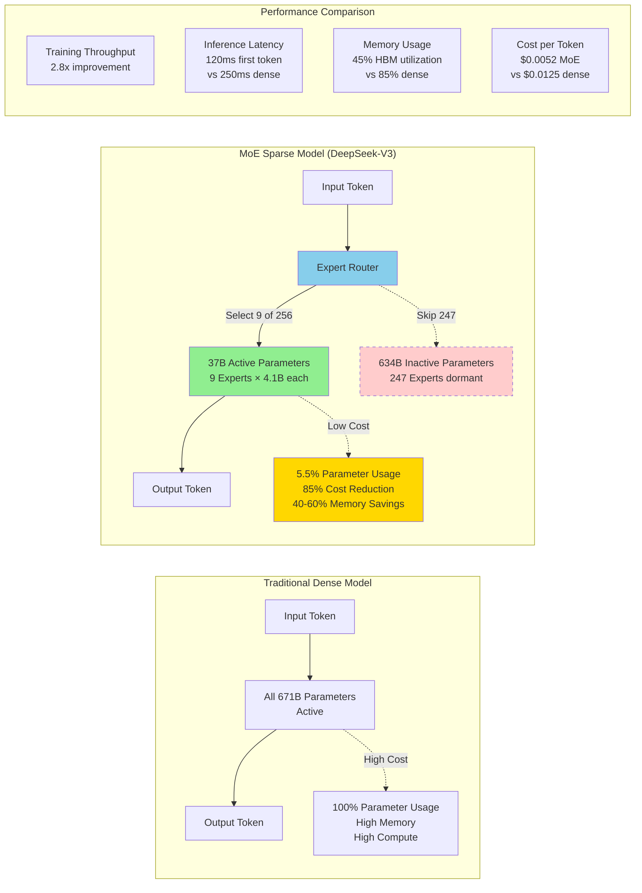

# Mixture-of-Experts (MoE) Architecture Benefits

## Context
This visualization demonstrates the revolutionary impact of MoE architecture on LLM efficiency, showing how sparse activation patterns enable massive models with manageable inference costs.

## Visualization

## Key Insights
- MoE enables 671B parameter models with only 37B active parameters per token
- 85% reduction in inference costs through sparse activation
- Expert routing adds minimal latency while dramatically reducing compute
- AWS Trainium2 provides hardware sparsity support for optimal MoE performance