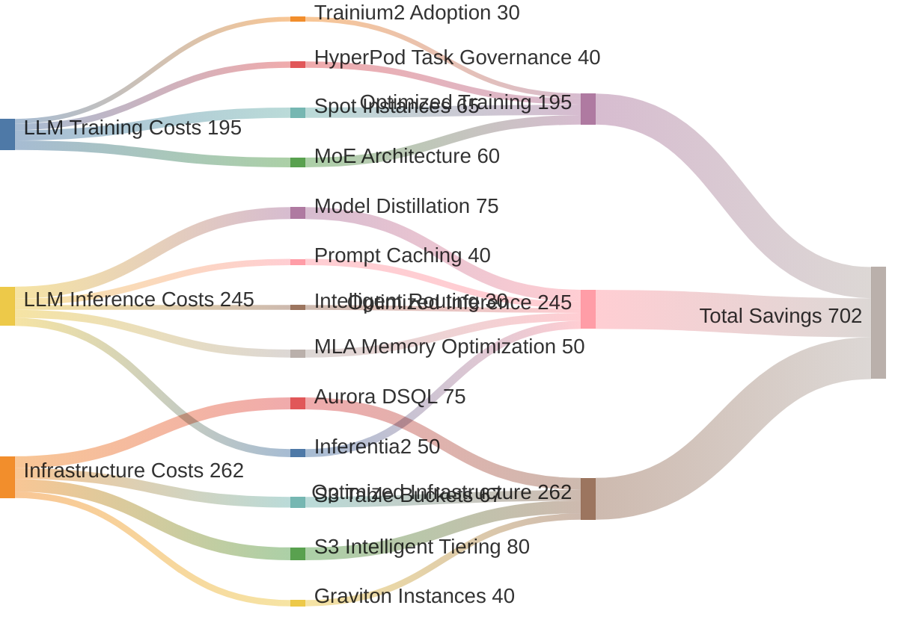

# Comprehensive Cost Reduction Summary

## Context
This visualization summarizes all cost reduction opportunities identified in the report, showing cumulative savings potential across different optimization strategies.

## Visualization

## Key Insights
- Combined optimization strategies can achieve 60-85% total cost reduction
- Inference optimizations provide the highest ROI (up to 75% with distillation)
- Infrastructure modernization delivers consistent 40-80% savings
- Multiple optimization layers compound for maximum benefit