# End-to-End LLM Training Pipeline Workflow

## Context
This workflow diagram illustrates the complete training pipeline for modern LLMs on AWS, from data preparation through model deployment, incorporating all optimization strategies.

## Visualization

```mermaid
stateDiagram-v2
    [*] --> DataPrep: Start Training Pipeline
    
    state DataPrep {
        [*] --> S3Ingest: Upload Raw Data
        S3Ingest --> S3Tables: Create Table Buckets<br/>3x query performance
        S3Tables --> Preprocessing: SageMaker Processing<br/>Data cleaning & tokenization
        Preprocessing --> DataReady: Training Data Ready
    }
    
    DataPrep --> ModelConfig: Configure Architecture
    
    state ModelConfig {
        [*] --> ArchSelect: Select Architecture
        ArchSelect --> MoEConfig: Configure MoE<br/>256 experts, 9 active
        ArchSelect --> AttentionConfig: Configure Attention<br/>MLA, GQA, or Sliding
        MoEConfig --> NormConfig: Configure Normalization<br/>RMSNorm, QK-Norm
        AttentionConfig --> NormConfig
        NormConfig --> ConfigReady: Model Configured
    }
    
    ModelConfig --> Training: Begin Training
    
    state Training {
        [*] --> InstanceSelect: Select Instances
        InstanceSelect --> P6e: P6e-GB200<br/>Frontier models
        InstanceSelect --> Trn2: Trainium2<br/>30-40% cost savings
        InstanceSelect --> P5en: P5en<br/>Standard training
        
        P6e --> HyperPod: SageMaker HyperPod<br/>Task governance
        Trn2 --> HyperPod
        P5en --> HyperPod
        
        HyperPod --> Distributed: Distributed Training<br/>EFA 3.2 Tbps
        Distributed --> Checkpointing: Regular Checkpoints<br/>S3 versioning
        Checkpointing --> Monitor: CloudWatch Monitoring
        Monitor --> TrainingLoop: Training Loop
        TrainingLoop --> Distributed
        TrainingLoop --> Complete: Training Complete
    }
    
    Training --> Optimization: Model Optimization
    
    state Optimization {
        [*] --> Distillation: Model Distillation<br/>500% faster, 75% cheaper
        Distillation --> Quantization: Quantization<br/>FP8/INT8
        Quantization --> Pruning: Pruning<br/>Remove redundant params
        Pruning --> OptimizedModel: Optimized Model
    }
    
    Optimization --> Deployment: Deploy Model
    
    state Deployment {
        [*] --> Registry: SageMaker Model Registry
        Registry --> Bedrock: Deploy to Bedrock<br/>Serverless inference
        Registry --> Endpoint: SageMaker Endpoint<br/>Real-time inference
        Registry --> Batch: Batch Transform<br/>High-throughput
        
        Bedrock --> Monitoring: Production Monitoring
        Endpoint --> Monitoring
        Batch --> Monitoring
        Monitoring --> [*]: Pipeline Complete
    }
    
    Deployment --> [*]: Model Deployed
```

## Key Insights
- End-to-end pipeline leverages 10+ AWS services for optimization
- Each stage offers 30-75% cost reduction opportunities
- Automated orchestration through SageMaker HyperPod reduces setup time from weeks to days
- Continuous monitoring enables iterative improvements