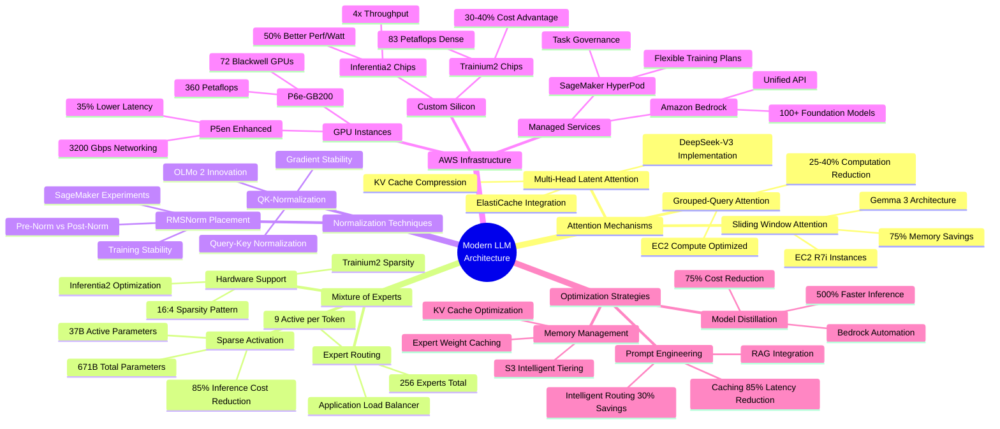

# LLM Architecture Innovations Mind Map

## Context
This mind map provides a comprehensive overview of all architectural innovations in modern LLMs and their corresponding AWS service alignments, helping visualize the complete ecosystem.

## Visualization

## Key Insights
- Architectural innovations focus on three main areas: attention, sparsity, and normalization
- AWS provides hardware and software support for each innovation category
- Combined optimizations achieve 60-85% total cost reduction
- Future architectures will likely continue the trend toward sparsity and efficiency