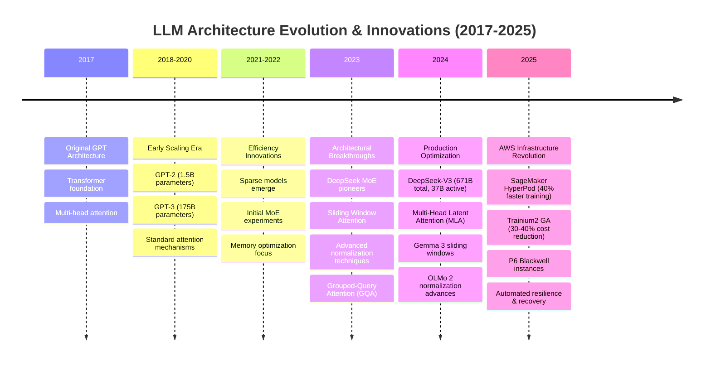

# LLM Architecture Evolution Timeline

This timeline visualizes the rapid evolution of Large Language Model architectures from the original GPT to modern state-of-the-art implementations, highlighting key innovations and their impact on computational efficiency and performance.

## Key Architectural Milestones

The evolution demonstrates remarkable consistency in foundational design while introducing targeted optimizations. Compute requirements have grown 4x annually over the past five years, necessitating specialized infrastructure and optimization strategies. Modern architectures have converged on several critical innovations: Mixture-of-Experts (MoE) for computational efficiency, advanced attention mechanisms for memory optimization, and specialized normalization techniques for training stability.