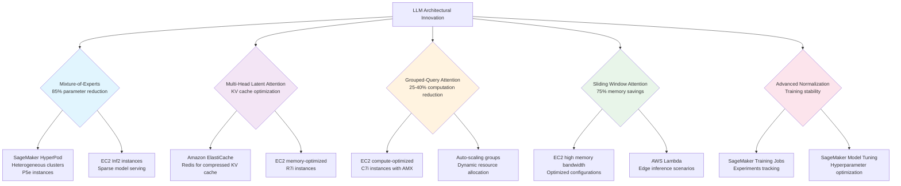

# Critical Architectural Innovations and AWS Service Alignment

This flowchart illustrates the relationship between modern LLM architectural innovations and their optimal AWS service implementations, showing how each innovation maps to specific infrastructure components for maximum performance and cost efficiency.

## Innovation Impact Analysis

Each architectural innovation creates distinct opportunities for AWS service optimization:
- **MoE**: Enables 60-85% inference cost reduction through parameter sparsity
- **MLA**: Significant KV cache memory reduction, optimized for ElastiCache deployment
- **GQA**: Reduces attention computation by 25-40%, ideal for compute-optimized instances
- **SWA**: Achieves up to 75% memory savings, enabling edge deployment scenarios
- **Advanced Normalization**: Improves training stability with minimal complexity overhead