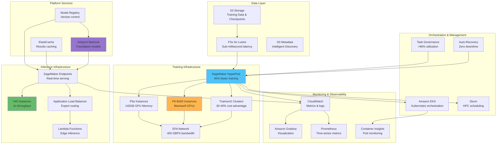

# AWS LLM Pipeline Architecture

This comprehensive architecture diagram shows the complete AWS service ecosystem for end-to-end LLM training and inference pipelines, from data ingestion through model deployment and monitoring.

## Infrastructure Integration Points

The architecture demonstrates AWS's comprehensive ecosystem for LLM workloads:
- **Training Foundation**: HyperPod provides resilient infrastructure reducing training time by 40%
- **Compute Flexibility**: Multiple instance types (P6, P5e, Trainium2) for different workload requirements
- **Network Performance**: 400 GBPS EFA bandwidth enables efficient distributed training
- **Inference Optimization**: Dedicated Inferentia2 chips provide 4x throughput improvement
- **Platform Services**: Bedrock offers unified access to foundation models with enterprise security
- **Observability Stack**: Integrated monitoring with Grafana, Prometheus, and Container Insights