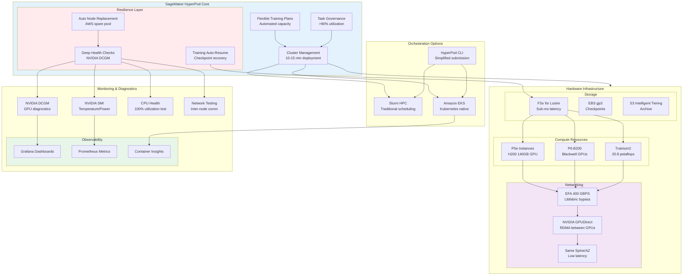

# SageMaker HyperPod Infrastructure Architecture

This detailed diagram illustrates the comprehensive SageMaker HyperPod infrastructure, showcasing its resilient architecture, auto-healing capabilities, and performance optimization features that enable 40% faster training with zero-downtime recovery.

## HyperPod Key Features

**Infrastructure Management:**
- **Cluster Creation**: 10-15 minutes for full deployment
- **Heterogeneous Clusters**: Multiple instance groups for training and inference
- **Warm Pools**: Low-latency job startup reducing idle time

**Resilience & Recovery:**
- **Deep Health Checks**: GPU pressure testing before deployment
- **Auto-Recovery**: Automatic restart from last checkpoint after hardware failure
- **Industry Context**: Meta's LLaMA training experienced 1 GPU failure every 3 hours - HyperPod handles automatically

**Performance Optimization:**
- **Resource Utilization**: >90% accelerated compute utilization across projects
- **Dynamic Allocation**: Automated prioritization across inference, training, and fine-tuning
- **Cost Reduction**: Up to 40% through dynamic resource allocation