# Distributed Training Pipeline Workflow

This flowchart illustrates the comprehensive distributed training workflow for large language models, showing data flow, gradient synchronization, checkpointing, and recovery mechanisms within the HyperPod ecosystem.

```mermaid
flowchart TD
    Start[Training Job Initialization] --> DataPrep[Data Preparation]
    DataPrep --> ClusterSetup[Cluster Setup<br/>10-15 minutes]
    
    ClusterSetup --> HealthChecks[Deep Health Checks<br/>NVIDIA DCGM]
    HealthChecks --> InitNodes[Initialize Training Nodes]
    
    InitNodes --> LoadData[Load Training Data<br/>FSx for Lustre]
    LoadData --> LoadModel[Load Model Shards<br/>Distributed across GPUs]
    
    LoadModel --> TrainLoop{Training Loop}
    
    TrainLoop --> Forward[Forward Pass<br/>Distributed computation]
    Forward --> Backward[Backward Pass<br/>Gradient computation]
    Backward --> AllReduce[All-Reduce Operation<br/>EFA 400 GBPS]
    AllReduce --> UpdateWeights[Update Model Weights<br/>Synchronized]
    
    UpdateWeights --> Checkpoint{Checkpoint<br/>Every 100 steps?}
    Checkpoint -->|Yes| SaveCheckpoint[Save to S3<br/>Versioned storage]
    Checkpoint -->|No| ContinueTraining[Continue Training]
    SaveCheckpoint --> ContinueTraining
    
    ContinueTraining --> FailureCheck{Node Failure<br/>Detected?}
    FailureCheck -->|Yes| AutoReplace[Auto Node Replacement<br/>From spare pool]
    FailureCheck -->|No| ValidationCheck{Validation<br/>Step?}
    
    AutoReplace --> RestoreFromCheckpoint[Restore from Checkpoint<br/>Auto-resume]
    RestoreFromCheckpoint --> TrainLoop
    
    ValidationCheck -->|Yes| RunValidation[Run Validation<br/>Spot instances]
    ValidationCheck -->|No| TrainLoop
    
    RunValidation --> ValidationResults[Validation Results<br/>Logged to experiments]
    ValidationResults --> ConvergenceCheck{Training<br/>Complete?}
    
    ConvergenceCheck -->|No| TrainLoop
    ConvergenceCheck -->|Yes| FinalModel[Final Model<br/>Export to Registry]
    
    FinalModel --> CleanupCluster[Cleanup Cluster<br/>Release resources]
    CleanupCluster --> End[Training Complete]

    subgraph MoE["MoE-Specific Steps"]
        ExpertRouting[Expert Routing<br/>Load balancing]
        ExpertActivation[Expert Activation<br/>9 of 256 active]
        ExpertCommunication[Expert Communication<br/>Inter-node routing]
    end

    TrainLoop --> ExpertRouting
    ExpertRouting --> ExpertActivation
    ExpertActivation --> ExpertCommunication
    ExpertCommunication --> Forward

    style TrainLoop fill:#4fc3f7
    style FailureCheck fill:#ffcdd2
    style AutoReplace fill:#c8e6c9
    style MoE fill:#fff3e0
```

## Training Pipeline Components

**Distributed Training Strategy:**
- **MoE Expert Distribution**: High-bandwidth inter-node communication via EFA (400 GBPS)
- **Gradient Synchronization**: Efficient all-reduce operations optimized for AWS network topology
- **Data Loading**: FSx for Lustre with sub-millisecond latency for concurrent thousand-instance access
- **Checkpointing**: Automated checkpoint restoration with zero manual intervention recovery

**Fault Tolerance Features:**
- **Automatic Recovery**: Training auto-resume from last checkpoint after hardware failure
- **Node Replacement**: Automatic replacement from AWS-maintained spare pool at no additional cost
- **Spot Instance Strategy**: 60-70% cost reduction for validation runs with 100-step checkpointing
- **Health Monitoring**: Continuous DCGM diagnostics and temperature/power management