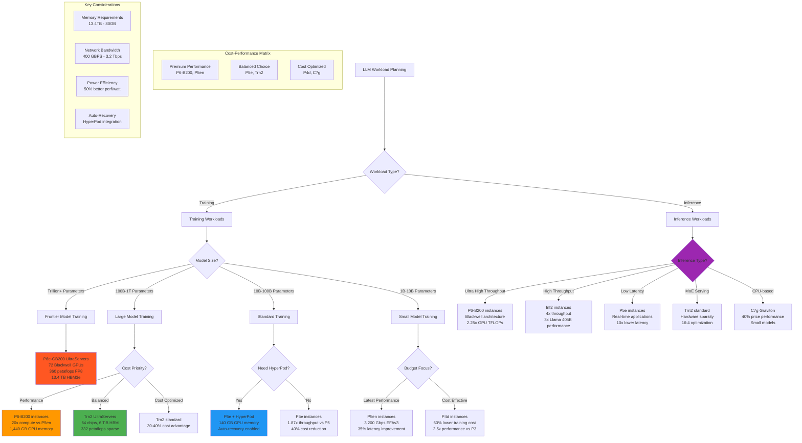

# EC2 Instance Selection Guide for LLM Workloads

This decision tree provides comprehensive guidance for selecting optimal EC2 instance types based on model size, workload requirements, and cost considerations, helping organizations choose the most suitable infrastructure for their LLM projects.

## Instance Selection Matrix

**Training Workloads:**
- **P6e-GB200 UltraServers**: Frontier AI training with 72 Blackwell GPUs and 360 petaflops
- **P6-B200**: Next-gen large models with 20x compute improvement over P5en
- **Trn2 UltraServers**: Massive scale with 30-40% cost advantage over GPU instances
- **P5e + HyperPod**: Resilient training with 40% faster completion times

**Inference Workloads:**
- **Inf2 instances**: 4x throughput improvement with 50% better performance/watt
- **P6-B200**: Ultra-high throughput for demanding real-time applications
- **Trn2**: Optimized for MoE architectures with hardware sparsity support
- **C7g Graviton**: Cost-effective CPU inference for smaller models

**Performance Metrics:**
- **P6e-GB200**: 13.4 TB HBM3e, 130 TB/s NVLink, 3.2 Tbps EFA
- **P6-B200**: 1,440 GB GPU memory, 20x compute vs P5en
- **Trn2**: 20.8 petaflops, 30-40% cost advantage
- **Inf2**: 4x throughput, 10x lower latency, 50% power efficiency