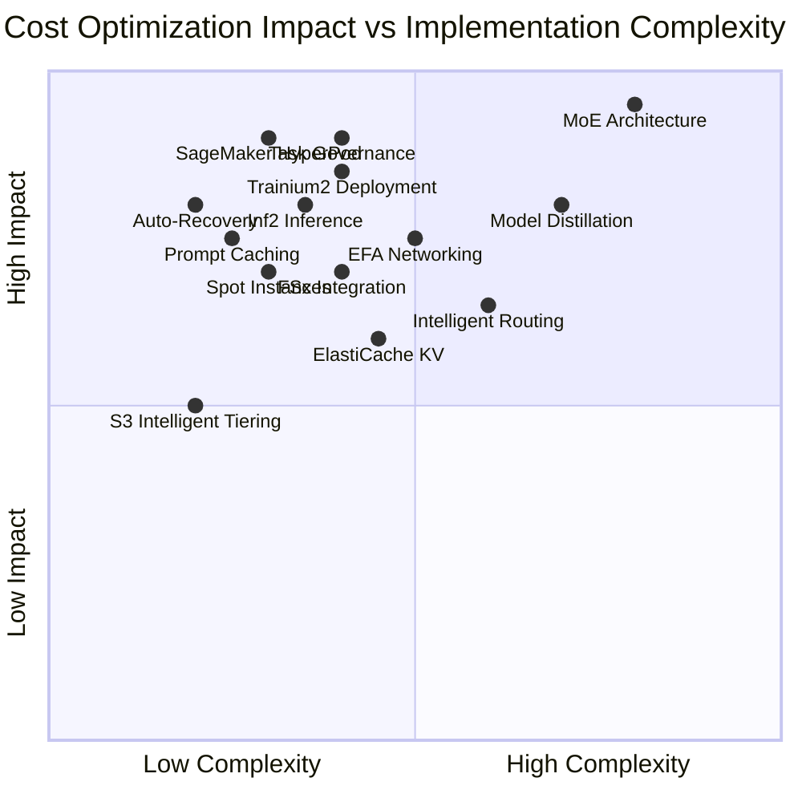

# Cost Optimization Matrix for LLM Deployments

This matrix visualization demonstrates the comprehensive cost optimization opportunities across training and inference workloads, showcasing specific percentage savings and strategic implementation approaches for maximum ROI.

## Cost Optimization Categories

**High Impact, Low Complexity (Quick Wins):**
- **SageMaker HyperPod**: 40% faster training with 10-15 minute setup
- **Auto-Recovery**: Zero manual intervention, eliminating hours of downtime
- **Prompt Caching**: 85% latency reduction for cached prompts
- **Trainium2**: 30-40% price performance advantage over GPU instances

**High Impact, High Complexity (Strategic Investments):**
- **MoE Architecture**: 60-85% inference cost reduction through parameter sparsity
- **Model Distillation**: 500% performance improvement with 75% cost reduction
- **Task Governance**: >90% resource utilization across all workloads

**Medium Impact, Low-Medium Complexity (Operational Efficiency):**
- **Spot Instances**: 60-70% cost savings for validation workloads
- **EFA Networking**: 400 GBPS bandwidth enabling efficient distributed training
- **FSx Integration**: Sub-millisecond latency preventing GPU idle time
- **Inf2 Inference**: 4x throughput with 50% better performance/watt

## ROI Analysis by Implementation

| Optimization | Cost Reduction | Implementation Time | Payback Period |
|-------------|---------------|---------------------|----------------|
| **HyperPod Deployment** | 40% training cost | 1-2 weeks | 1-2 months |
| **Trainium2 Migration** | 30-40% vs GPU | 2-4 weeks | 2-3 months |
| **MoE Implementation** | 60-85% inference | 2-6 months | 3-6 months |
| **Auto-Recovery Setup** | Zero downtime cost | 1 week | Immediate |
| **Spot Instance Strategy** | 60-70% validation | 2 weeks | 1 month |
| **Prompt Caching** | 85% latency cost | 1-2 weeks | 1 month |