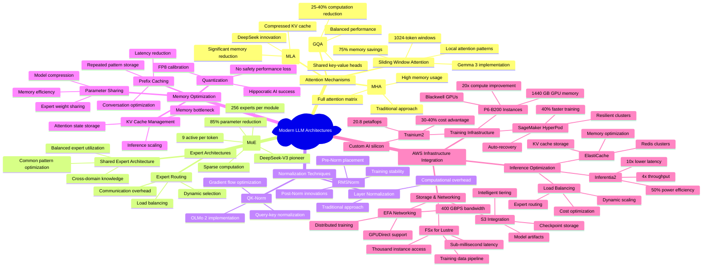

# Modern LLM Architecture Patterns and Innovations

This comprehensive mindmap visualizes the interconnected landscape of modern LLM architectural innovations, highlighting the relationships between different optimization techniques and their impact on computational efficiency and performance.

## Architectural Evolution Insights

The modern LLM landscape demonstrates convergence on several critical innovations that create distinct opportunities for AWS service optimization:

**Attention Mechanism Evolution:**
- From traditional MHA to specialized variants (MLA, GQA, Sliding Window)
- Focus on memory efficiency and computational reduction
- Integration with AWS memory-optimized instances and caching services

**Expert Architecture Maturation:**
- MoE enables 85% parameter reduction during inference
- Requires sophisticated routing and load balancing infrastructure
- Perfectly aligned with AWS heterogeneous cluster capabilities

**Memory-First Design Philosophy:**
- KV cache optimization becomes critical at scale
- Quantization and compression techniques maintain quality
- AWS ElastiCache and memory-optimized instances provide foundation

**Infrastructure-Architecture Alignment:**
- Purpose-built silicon (Trainium2) for AI workloads
- Network-optimized designs (EFA, GPUDirect) for distributed training
- Resilient infrastructure (HyperPod) for large-scale deployments