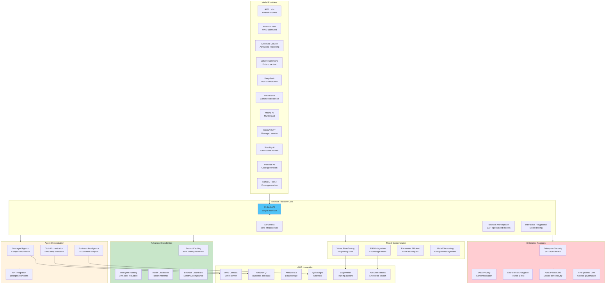

# Amazon Bedrock Ecosystem and Platform Integration

This comprehensive diagram illustrates the Amazon Bedrock platform ecosystem, showcasing model provider diversity, enterprise features, and integration capabilities that enable unified foundation model access with enterprise-grade security and compliance.

## Bedrock Platform Advantages

**Unified Model Access:**
- **Single API**: Access to 100+ foundation models from leading AI providers
- **Serverless Infrastructure**: No infrastructure management required
- **Cost Optimization**: 30% reduction through intelligent routing to optimal models

**Enterprise Security Framework:**
- **Regulatory Compliance**: SOC, ISO, HIPAA certification for enterprise deployment
- **Data Privacy**: Content isolation with no usage for base model improvement
- **Zero Data Leakage**: Complete separation between customization and base training

**Advanced Optimization Features:**
- **Prompt Caching**: Up to 85% latency reduction for frequently repeated prompt prefixes
- **Model Distillation**: Faster inference with maintained accuracy at lower cost
- **Intelligent Routing**: Automatic model selection based on prompt complexity

**Enterprise Integration Ecosystem:**
- **SageMaker Integration**: Seamless training to inference pipeline
- **Knowledge Base RAG**: Native retrieval-augmented generation capabilities
- **Agent Orchestration**: Managed multi-step workflow execution
- **Business Intelligence**: Integration with QuickSight and Amazon Q

**Model Customization Without Complexity:**
- **Visual Fine-Tuning**: No-code model customization interface
- **Parameter Efficient Training**: LoRA and other cost-effective adaptation techniques
- **Model Versioning**: Comprehensive lifecycle management
- **Custom Model Registry**: Centralized model governance