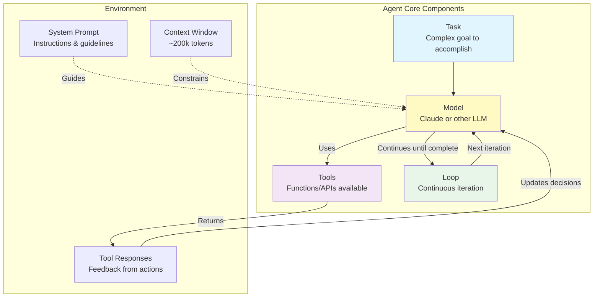

# Agent Definition Framework

## Context
From the transcript, agents at Anthropic are defined as "models using tools in a loop" - a simple yet powerful concept that forms the foundation of their approach.

## Visualization

## Key Insight
The simplicity of this definition - "models using tools in a loop" - belies the complexity of implementation. The agent operates independently, making decisions based on tool responses and continuing until task completion.