# Agent vs Workflow Decision Checklist

## Context
The transcript provides a clear framework for deciding when to use agents versus simpler approaches like workflows or classification models.

## Visualization

```mermaid
flowchart TD
    Start["Task to Automate"]
    
    Complex["Is the task complex?<br/>Unknown path to solution?"]
    Valuable["Is the task valuable?<br/>High leverage/revenue generating?"]
    Doable["Are parts doable?<br/>Can you provide needed tools?"]
    ErrorCost["Low error cost?<br/>Can errors be recovered?"]
    
    UseAgent["✅ Use Agent<br/>Complex, valuable, autonomous tasks"]
    UseWorkflow["⚙️ Use Workflow<br/>Step-by-step process known"]
    UseHuman["👤 Human in Loop<br/>High error cost/detection difficulty"]
    UseSimple["📝 Use Simple Prompt<br/>Low value/complexity"]
    
    Start --> Complex
    Complex -->|"Yes"| Valuable
    Complex -->|"No<br/>Clear steps"| UseWorkflow
    
    Valuable -->|"Yes"| Doable
    Valuable -->|"No<br/>Low value"| UseSimple
    
    Doable -->|"Yes"| ErrorCost
    Doable -->|"No<br/>Missing tools"| UseWorkflow
    
    ErrorCost -->|"Yes<br/>Recoverable"| UseAgent
    ErrorCost -->|"No<br/>Costly errors"| UseHuman
    
    style UseAgent fill:#c8e6c9
    style UseWorkflow fill:#fff9c4
    style UseHuman fill:#ffccbc
    style UseSimple fill:#e1bee7
```

## Key Examples from Transcript
- **Good for Agents**: Coding (design doc → PR), data analysis, search with citations
- **Not for Agents**: Simple classifications, known step-by-step processes, high-risk operations