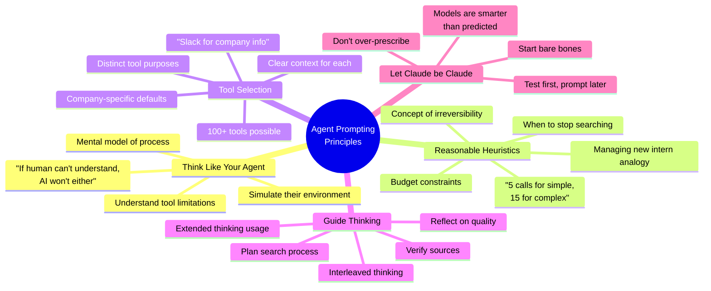

# Core Prompting Principles for Agents

## Context
Jeremy emphasizes that prompting is "conceptual engineering" - not just about text, but about deciding what concepts the model should have and what behaviors it should follow.

## Visualization

## Key Insight
"Prompting is not going away and will get more important, not less important as models get smarter" - because it's about conceptual engineering, not just text formatting.