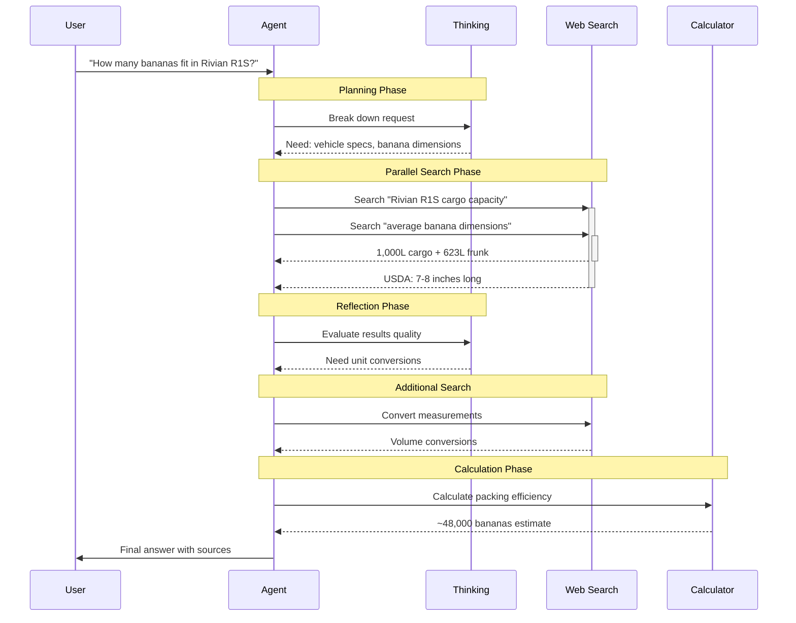

# Agent Workflow Example: Research Process

## Context
The transcript demonstrates a concrete example of an agent researching "How many bananas can fit in a Rivian R1S?" showing the iterative tool use and thinking process.

## Visualization

## Key Pattern
Notice the interleaved thinking between tool calls - a new capability in Claude 4 models that allows reflection and planning between actions.