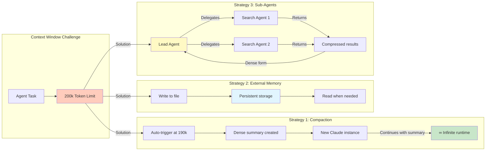

# Context Window Management Strategies

## Context
With a 200k token context window, agents need strategies to handle long-running tasks effectively. The transcript describes several approaches used in production.

## Visualization

## Production Example
Claude Code uses compaction to run "infinitely" - automatically summarizing context at ~190k tokens and passing to a fresh instance.