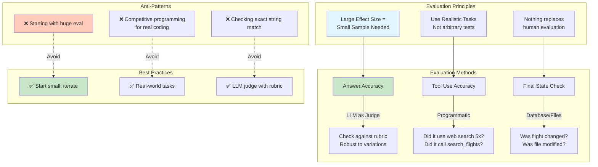

# Agent Evaluation Framework

## Context
Evaluating agents is more complex than traditional classification tasks. The transcript provides a practical framework for building effective evaluations.

## Visualization

## Key Quote
"Very quickly, you'll notice that it's difficult to really make progress on a prompt if you don't have an eval that tells you meaningfully whether your prompt is getting better."