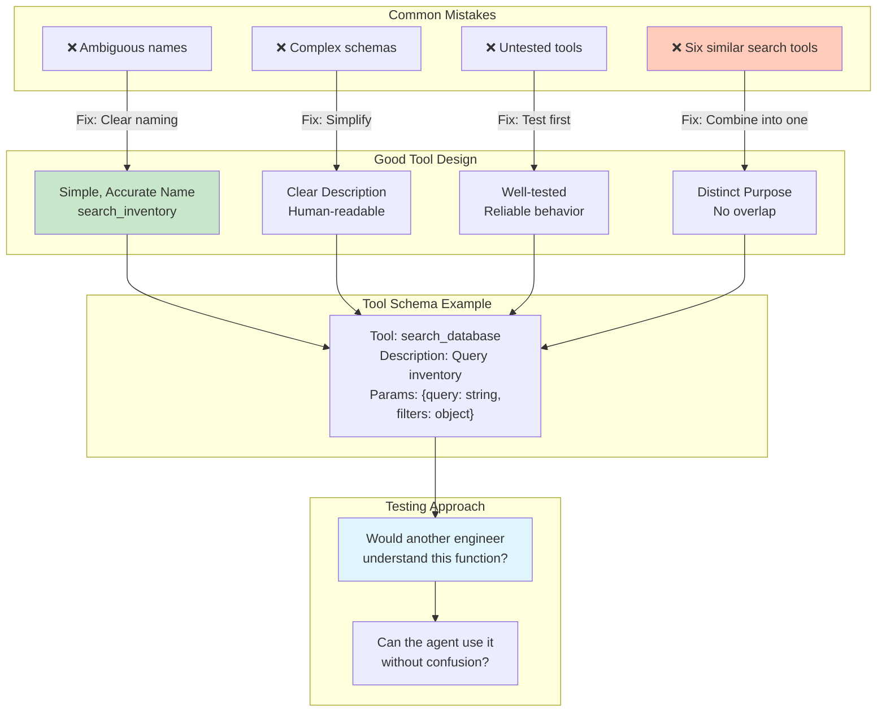

# Tool Design Principles for Agents

## Context
Good tool design is critical for agent success. The transcript emphasizes making tools that are clear, distinct, and usable by both humans and AI.

## Visualization

## Key Principle
"Imagine you give a function to another engineer on your team - would they understand this function and be able to use it? Ask the same question about the agent."