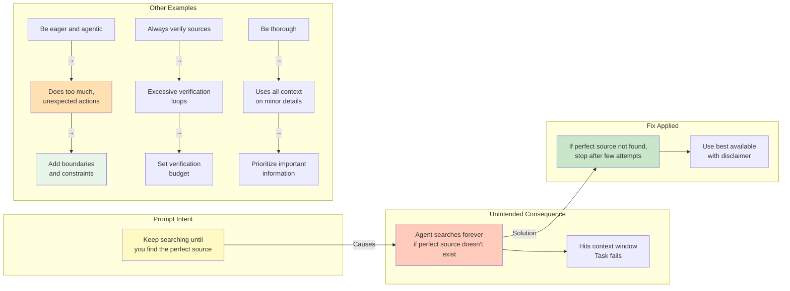

# Managing Unintended Side Effects in Agent Prompts

## Context
The transcript warns that "agents are more unpredictable than workflows" and most prompt changes will have unintended side effects due to autonomous operation.

## Visualization

## Key Lesson
Test prompts in realistic scenarios and watch for edge cases. The autonomous nature of agents amplifies any ambiguity in instructions.